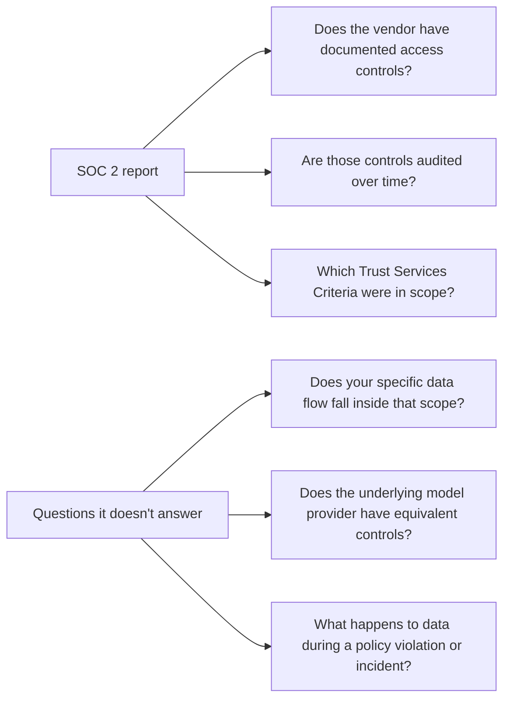

"Are you SOC 2 compliant?" is the single most common question in an AI vendor security review, and it's also one where the answer matters less than the follow-up questions almost nobody asks. SOC 2 is a real, meaningful attestation — it's just narrower than the question implies.

{/* truncate */}

## What a SOC 2 report actually is

SOC 2 isn't a certification with a fixed checklist — it's an independent auditor's report on whether a company's controls meet the criteria it *claims* to meet, across some subset of five Trust Services Criteria: security, availability, processing integrity, confidentiality, and privacy. A vendor chooses which criteria to be audited against, and a Type II report additionally covers whether those controls operated effectively over a period (commonly six or twelve months), not just whether they existed on the day of the audit.

That means "SOC 2 compliant" can describe meaningfully different scopes. A report covering only the Security criterion says less than one covering Security, Confidentiality, and Privacy — and for an AI vendor specifically, the criteria that matter most (how prompt data is handled, retained, and who can access it) live mostly under Confidentiality and Privacy, not just Security.

## Questions the report answers, and questions it doesn't

A SOC 2 report tells you the vendor has real, audited controls for whatever scope was chosen. It doesn't automatically tell you that your specific use case — the actual data flowing through their system — falls inside the audited boundary. A vendor's SOC 2 might cover their application infrastructure while the model provider they route to underneath has its own separate compliance posture, audited separately or not at all from your vendor's report.

## What to actually ask in an AI vendor review

- **Which Trust Services Criteria are in scope**, not just "are you SOC 2." Confidentiality and Privacy matter more than Availability for most AI data-handling concerns.
- **Type I or Type II**, and what period the Type II covers. A Type I only confirms controls existed on a single day; it says nothing about whether they held up over time.
- **Does the report's scope include the AI-specific data path** — prompt handling, third-party model routing, retention — or just the vendor's general application infrastructure that predates their AI feature.
- **What's the subprocessor list**, and does it include the model providers being routed to. A vendor's own report doesn't extend to a subprocessor's controls; that's a separate question with a separate answer.

## The honest limit of any compliance report

A report — SOC 2, ISO 27001, whatever — is evidence that a specific, bounded set of controls existed and were audited. It's not evidence that a vendor is safe in some general sense, and it's not a substitute for reading the actual scope and asking where your specific data flow sits relative to it. The vendors worth trusting are the ones that make this easy to check, not the ones that lead with the badge and get vague about the boundary.
