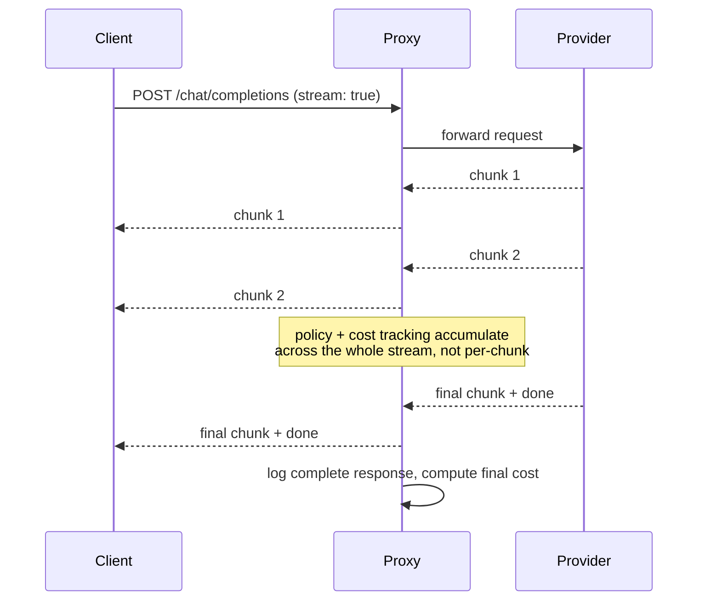

Most API gateway logic — including a fair amount of early LLM proxy code — is written with an implicit assumption: a request comes in, a complete response comes back, the proxy inspects it, forwards it, done. Streaming breaks that assumption at the root, and a surprising number of downstream features have to be rebuilt around it rather than layered on top.

{/* truncate */}

## What's actually different about SSE

Server-Sent Events deliver a response as an open connection emitting incremental chunks over time, not a single complete payload. For an LLM call, that means the proxy has to hold a connection open — sometimes for tens of seconds on a long generation — while relaying chunks as they arrive, instead of doing request-response-done in milliseconds.

## Where this breaks naive implementations

- **Policy enforcement on a response you haven't fully seen yet.** Output-side guardrails (checking a response for leaked data, policy violations) are straightforward against a complete response. Against a stream, the proxy either has to buffer the whole thing before releasing it (which defeats the point of streaming — the client wanted low latency to first token) or evaluate incrementally and accept that a violation might only be detectable after some tokens have already reached the client. There's no clean answer here; different products make different tradeoffs, and neither is free.
- **Cost and token accounting mid-stream.** The exact token count usually isn't known until the stream completes. Rate limiting and budget enforcement that assumed a request either succeeds or fails atomically now has to handle "this request is in progress and we don't know its final cost yet" as a real state, not an edge case.
- **Timeouts mean something different.** A gateway timeout tuned for typical request-response latency (a few seconds) will kill a legitimate long-running generation. Streaming requires timeout logic based on *time since last chunk*, not total request duration — otherwise a perfectly healthy slow generation gets terminated mid-stream.
- **Connection failures mid-generation.** If the connection to the client drops halfway through a stream, does the provider call get cancelled (saving cost) or does it run to completion in the background (so a reconnect could resume, or so the full response gets logged)? Both are defensible, and picking one has real cost and UX implications — silently doing neither, and just leaking the orphaned request, is the actual common failure mode in a first implementation.
- **Caching a streamed response.** A cache needs the complete response to store, which means either buffering server-side before caching (adding latency to the cache-write path, invisible to the client) or accepting that streamed responses simply don't get cached, which quietly excludes a growing share of traffic from a cost-saving feature as more clients adopt streaming by default.

## The practical takeaway

None of this means streaming should be avoided — the latency-to-first-token improvement is real and matters a lot for interactive UX. It means a proxy's policy engine, cost tracking, and caching layer all need an explicit design decision for the streaming path, not an assumption that logic built for buffered responses will transfer over. The gap between "we support streaming" (the connection stays open and chunks pass through) and "streaming is handled correctly" (policy, cost, and caching all behave sanely against it) is exactly where a lot of homegrown proxies quietly degrade to "streaming just bypasses the guardrails," often without anyone deciding that on purpose.
