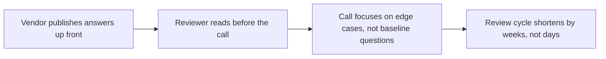

Every AI vendor security review converges on roughly the same dozen questions, and the review process is faster — for the buyer and the vendor — when the answers exist in writing before anyone has to ask. This is the version of that questionnaire we'd want a reviewer to see, answered the way we'd actually answer it, not the marketing-safe version.

{/* truncate */}

## The questions that come up every time

**Where does prompt data actually go, and who can see it?** — Whatever the deployment model is (self-hosted, hybrid, hosted), the honest answer needs to name the specific data path: does it leave the customer's network, does it pass through the vendor's own servers, does it reach a third-party model provider, and who at the vendor (if anyone) can access it in transit or at rest.

**Is data used to train models?** — This needs a direct yes/no, not a link to a general privacy policy. For most B2B AI infrastructure vendors the answer should be no by default, with training use requiring explicit opt-in — but "should be" isn't the same as verified, so the reviewer should expect this in the actual contract terms, not just a webpage claim.

**What's the subprocessor list?** — Every model provider, every logging/observability backend, every cloud provider in the chain. A vendor that can't produce this list quickly hasn't actually mapped their own data flow, which is itself a signal.

**How is data isolated between customers?** — For a multi-tenant system, this is usually the single most important architectural question. "Application-level checks" and "database-level row security enforced regardless of application code" are very different answers with very different failure modes if a bug ever slips through.

**What's logged, and for how long?** — Audit logging needs a specific retention answer, not "as long as needed." A reviewer should be able to get a straight number, and understand whether that number is configurable per their compliance requirement.

**What happens during an incident?** — Not "do you have an incident response plan" (everyone says yes) but the specifics: notification timeline commitments, whether affected customers get told which of their data was involved, whether there's a way to audit exactly what happened after the fact.

## Why publishing this proactively is worth doing

The instinct to keep this vague until directly asked is understandable but backwards — a security reviewer's job is to find the gap between what's claimed and what's true, and vagueness reads as something being hidden even when nothing is. A specific, checkable answer to "where does the data go" is more reassuring than a confident-sounding paragraph that doesn't actually name a data path, precisely because it's falsifiable — a reviewer can go verify it, and a vendor confident enough to invite that is a different signal than one that isn't.

The honest version of this document also has to include the questions where the answer is "it depends on configuration" rather than a clean yes — training-data opt-out, data residency, retention period are all things a customer typically has to actively configure, not defaults that apply automatically. Pretending otherwise in a questionnaire just moves the disappointment to implementation time instead of avoiding it.
