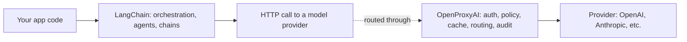

"LangChain vs. OpenProxyAI" is a comparison that gets searched for more than it should exist, because the two aren't really alternatives — they solve problems at different layers of the stack, and understanding why clarifies both products better than a feature-by-feature table would.

{/* truncate */}

## What LangChain actually is

LangChain is an application-layer orchestration framework: chains, agents, memory, retrieval pipelines, tool calling — the logic that decides *what* to ask a model, in what sequence, with what context assembled from where. It runs as code inside your application. It doesn't sit in the network path between your app and a model provider; it's a library your app imports and calls.

## What OpenProxyAI actually is

OpenProxyAI sits in the network path — it's the thing your HTTP request to a model provider actually goes through, regardless of what assembled that request. Auth, rate limiting, policy enforcement, caching, routing, and audit logging happen at that layer, for every call, independent of whether the call originated from a LangChain agent, a hand-written API call, or any other client.

They compose, they don't compete. A LangChain agent making a tool call still has to make an actual API call to a model at some point — pointing that call's base URL at OpenProxyAI instead of directly at a provider means every call from every chain, agent, and tool invocation in the application inherits the same policy enforcement and audit trail, without LangChain needing to know or care that a gateway exists underneath it.

## Where the comparison search actually comes from

Two things drive people to search this comparison even though it's a category error:

- **LangChain does have basic model-swapping abstractions** (its chat model interfaces support multiple providers with a broadly similar interface), which reads as overlapping with "route to multiple providers" until you look closer — LangChain's abstraction is for writing provider-agnostic *application code*, not for centralized policy enforcement, budget tracking, or an audit trail across everyone using it.
- **Some teams' first multi-provider routing logic lives inside a LangChain custom LLM wrapper**, because that's the layer they were already writing code in. That's a reasonable way to start, and it works until more than one application or team needs to share the same policy and budget logic — at which point duplicating that logic inside every app's LangChain wrapper stops scaling, which is the same build-vs-buy trajectory infrastructure problems generally follow.

## The actual honest framing

If the question is "how do I orchestrate a multi-step agent workflow with tools and memory," that's LangChain's problem to solve, and OpenProxyAI doesn't have an opinion on it. If the question is "how do I make sure every model call across my org — regardless of which application or framework made it — is authenticated, budgeted, policy-checked, and logged the same way," that's the layer OpenProxyAI sits at, underneath whatever orchestration framework (LangChain or otherwise) is generating the calls in the first place.
