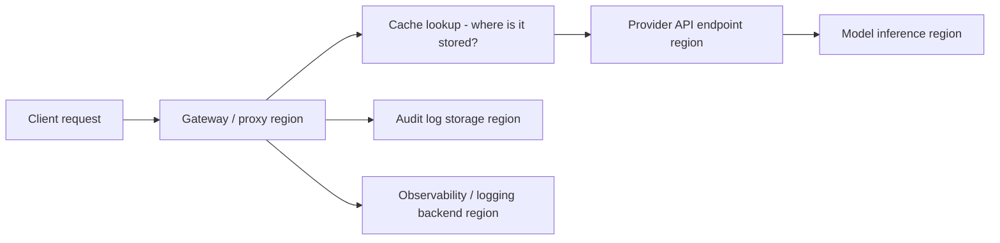

"Can you guarantee our data stays in the EU" is a common early question from regulated buyers, and it gets answered too narrowly most of the time — as if the only thing that matters is which region the model inference happens in. That's one piece of a larger picture.

{/* truncate */}

## The full path a request actually takes

Every one of those boxes can be in a different jurisdiction, and a residency requirement that only checks box D or E while ignoring the others hasn't actually been met — it's been partially checked. A cache entry stored in a US-region Redis instance, or an audit log shipped to a logging backend hosted outside the required jurisdiction, is a residency violation even if the model inference itself happened in the right region.

## What "region" actually needs to be pinned, specifically

- **Where the gateway/proxy itself runs.** If the infrastructure making the outbound call is hosted outside the required region, the request transited through that region even before reaching a provider.
- **Which provider API endpoint is called.** Most major providers now offer region-specific API endpoints (not just "the model," but the actual HTTPS endpoint the request hits) — calling the wrong regional endpoint out of habit or default config is the most common way this silently breaks.
- **Where cache data lives**, for any tier that persists content (Redis, a vector store) — a cache hit means the response is being served from wherever that store is hosted, regardless of where the original request would have gone.
- **Where audit logs and observability data are stored**, including any third-party logging or APM backend in the pipeline — this is the one most commonly missed, because it's added after the core residency requirement was already "satisfied" for the model call itself.

## Provider key scoping as the actual enforcement mechanism

The practical way to enforce this isn't a policy document, it's routing configuration: provider keys tagged with their region, and routing logic that filters candidate keys to only the approved region(s) for a given org or request *before* weighted rotation or failover selection happens — not as a manual check afterward. If failover to a healthy key in a different region is allowed to happen automatically for availability reasons, that's a residency violation waiting to happen the first time a regional outage triggers it, unless the failover pool itself is pre-filtered to approved regions only.

## The honest caveat

Full data residency for an AI workload is genuinely harder to guarantee end-to-end than for a typical SaaS product, because the request fans out to more independently-hosted pieces (provider infrastructure you don't control being the biggest one). A vendor can pin their own infrastructure's region precisely; they generally can't unilaterally guarantee where a third-party model provider physically processes a request beyond what that provider's own regional endpoint commits to. Any residency claim worth trusting should be specific about which of those pieces it's making a guarantee about, and which ones it's inheriting from an upstream provider's own commitments.
