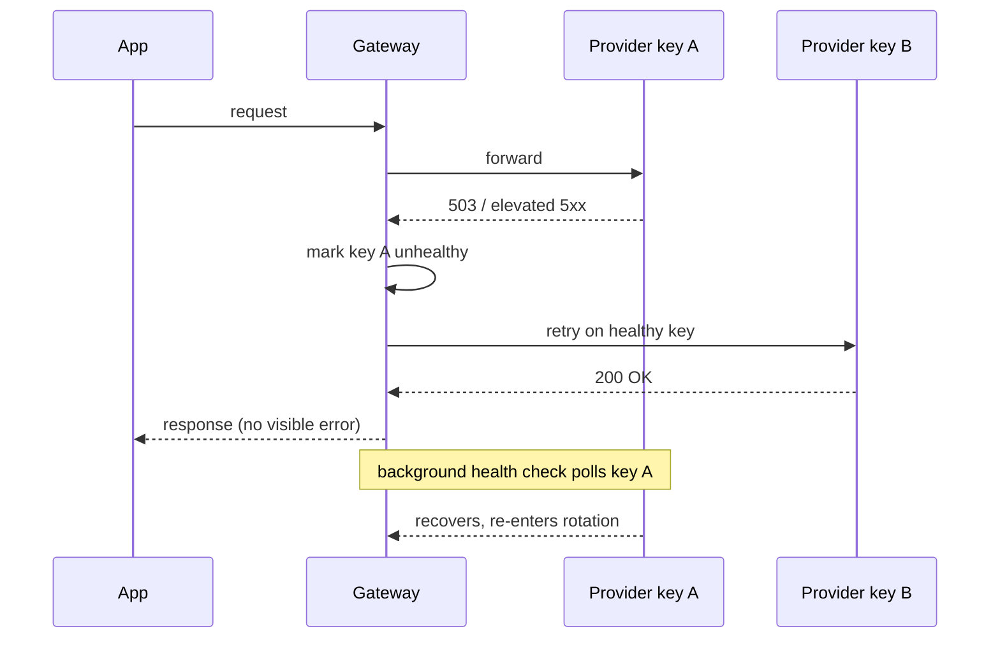

Every AI gateway's marketing page says some version of "automatic failover, zero downtime." The interesting engineering is in the gap between that sentence and a system that actually behaves that way at 3am when a provider region starts returning 503s.

{/* truncate */}

## The sequence, in order

Five things have to work correctly for that diagram to hold up under real traffic, and each one has a distinct failure mode if it's built casually.

## 1. Detecting "unhealthy" without over-reacting to noise

A single 500 response isn't evidence a key is down — providers return sporadic errors under normal operation. The detection logic needs a threshold (error rate over a rolling window, not a single failure) or it will flap a perfectly healthy key in and out of rotation on ordinary noise, which is worse than not having health checks at all: it turns background jitter into visible latency spikes.

## 2. Excluding the unhealthy key without dropping in-flight requests

Once a key is marked unhealthy, new requests need to stop routing to it — but requests already in flight against it shouldn't be silently abandoned. This is a coordination detail that's easy to skip in a first implementation: the naive version marks the key down and only the *next* request benefits, while the request that triggered the failure detection still has to time out and error back to the caller.

## 3. Redistributing weight, not just removing a key

If key A was carrying 40% of traffic by weight and it drops out of rotation, that 40% needs to redistribute across the remaining healthy keys — proportionally, not by picking one arbitrary key to absorb everything. A naive round-robin fallback can concentrate all the freed-up load onto whichever key happens to be checked next, creating a second failure from the first one.

## 4. Retrying without turning one failure into a retry storm

The retry itself needs a budget. Retrying indefinitely on every provider error, especially during a real regional outage, multiplies load against providers who are already degraded, and multiplies your own cost if the retried request is expensive. A capped retry (typically one immediate retry against a different key, not N retries against the same one) is the difference between "handled" and "made it worse."

## 5. Recovery has to be automatic and gradual

When the unhealthy key starts passing health checks again, it should re-enter rotation at its configured weight — not get skipped forever because nobody's watching, and not get slammed with full traffic immediately in case the recovery is itself flaky. Some implementations ramp a recovering key back in gradually rather than snapping straight to full weight; that's a reasonable extra safeguard once the basics work.

## Why "zero downtime" is the wrong bar

The honest framing isn't "the client never sees an error" — a request that was mid-flight when a key dies may still error once. The real bar is: the *next* request after a failure is detected succeeds, automatically, without a human paging in to manually swap a key or edit a config file. That's a meaningfully lower bar than "zero downtime," and it's the one that's actually achievable in the seconds a real outage takes to detect.
