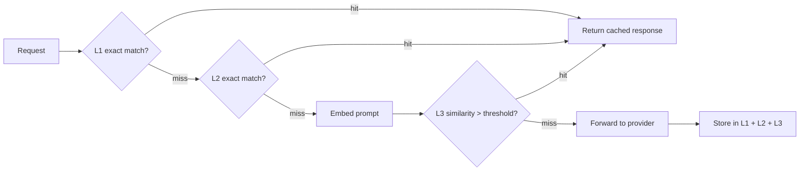

Every serious LLM caching writeup mentions three tiers, shows a latency table, and moves on. The interesting part isn't the latency table — it's what happens in the tier that doesn't do exact matching, because that's the one tier where "cache hit" and "wrong answer" are the same failure mode wearing a disguise.

{/* truncate */}

## The three tiers, briefly

- **L1 — in-memory.** Per-process TTL cache. Exact-match only: the same prompt, same parameters, same everything. Sub-millisecond, and only useful for genuinely repeated requests within one instance's lifetime.
- **L2 — Redis.** Same exact-match logic, shared across every instance so a cache warmed by one request serves every other instance too. Survives restarts. Still exact-match — a single character of difference is a miss.
- **L3 — semantic (pgvector).** This is the tier that actually catches paraphrases. The incoming prompt gets embedded, and a similarity search runs against previously cached prompt embeddings. Above a similarity threshold, it's treated as a hit and the cached response is returned without ever calling the provider.

## Where it breaks: the threshold is a business decision, not a math one

"Similarity > 0.85" reads like an engineering parameter. It's actually a policy decision about how much wrongness you're willing to serve in exchange for cost savings, and the two directions fail differently:

- **Threshold too loose** → "Summarize this contract for our Q3 filing" and "summarize this contract for our Q1 filing" get treated as the same request. The cached answer is fluent, confident, and about the wrong quarter. Nothing in the response signals that it came from a cache miss that should have happened.
- **Threshold too tight** → cache hit rate collapses toward the exact-match tiers, and you're paying provider costs for requests that were genuinely reusable, just phrased two words differently.

There's no threshold that's correct in general — it depends on how much semantic drift between "similar" prompts is tolerable for a given endpoint. A support chatbot answering "what are your hours" can tolerate a much looser threshold than a system generating numbers that go into a filing.

## Mitigations that actually help

1. **Segment cache namespaces by endpoint or use case**, not globally. A single global threshold optimized for FAQ-style traffic will misfire badly on anything where precise inputs matter.
2. **Cache-bust on anything time- or identity-sensitive.** Prompts referencing "today," a specific user, or a specific record shouldn't be semantically cached at all — namespace them out or tag them uncacheable at the call site.
3. **Version the cache alongside prompt template changes.** If the system prompt changes, old cached responses reflect the old prompt's behavior. Tie the cache key to a prompt-template version, not just the user-facing text.
4. **Expose the miss vs. semantic-hit distinction in logs.** If you can't tell after the fact whether a response came from a real generation or a similarity match, you can't debug a "why did it answer like that" report — which will happen.

Semantic caching is a genuinely good cost lever — a 30%+ hit rate against duplicate-ish traffic is common in support and internal-tools workloads. It's just not a free one. Treat the threshold as something a product owner signs off on per use case, not a number a config file quietly ships with.
