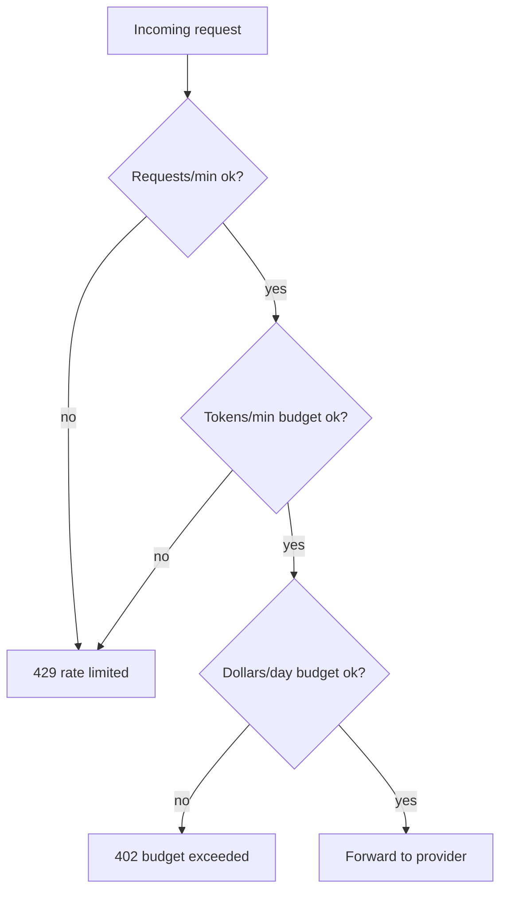

Rate limiting is one of those problems that looks solved the moment you've implemented it once, for one kind of traffic. LLM traffic is not that kind of traffic, and a limiter built for typical API request patterns will happily let through the exact requests capable of doing the most damage.

{/* truncate */}

## The asymmetry that breaks request-count limiting

A REST API rate limiter usually assumes requests cost roughly the same. Under "100 requests/minute," request #1 and request #100 consume comparable resources. That assumption is false for LLM calls in a way that matters: a request with a 200-token prompt and a request with a 190,000-token prompt both count as "one request," but one of them can cost 500x more and take proportionally longer to generate.

A client that sends 50 tiny requests and a client that sends 3 enormous ones can both be "within" a 100 req/min limit while one of them has consumed 40x the compute and cost.

## Three limits, checked together

- **Requests/minute** catches abusive call volume and runaway retry loops — the classic case a REST limiter is built for.
- **Tokens/minute** catches the asymmetry above: it limits actual throughput, not call count, so a handful of huge requests get throttled the same as a flood of small ones would.
- **Dollars/day** is the backstop that catches everything the first two miss, including price differences between models — a team hammering the most expensive model in the catalog trips this even if their request and token counts look fine.

None of the three is sufficient alone. Requests/minute misses cost asymmetry. Tokens/minute misses the case where a client sends a burst of small requests specifically to stay under the token ceiling. Dollars/day, checked in isolation with no upstream throttling, still lets a burst overwhelm your own infrastructure and the provider's before the budget check ever fires.

## The part that's genuinely hard: counting tokens before you've made the call

You know the exact token count for a response only after generation completes — but the rate limit decision has to happen before the request is sent. The practical approach is estimating input tokens against a tokenizer (cheap, mechanical) and budgeting output against `max_tokens` as a worst case, then reconciling the real usage against the budget after the response comes back. That reconciliation step is easy to forget and is exactly where budgets quietly drift from what a dashboard shows to what actually happened.

## Sliding window over fixed window

A fixed window ("100 requests per calendar minute") lets a client burst 100 requests at 0:59 and another 100 at 1:00 — 200 requests in two seconds, both individually compliant. A sliding window (or token-bucket refill) avoids the edge-of-window burst entirely, at the cost of slightly more state to track per key. For anything where the limit is meant to protect shared infrastructure — not just meter usage — the fixed-window edge case is a real production incident waiting for the right traffic pattern, not a theoretical one.
