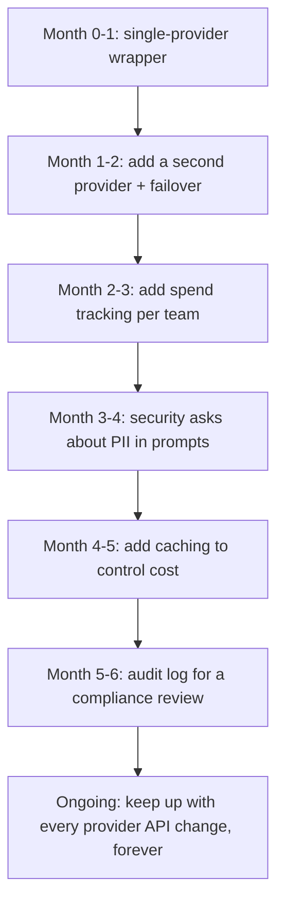

"We'll just build a thin wrapper around the OpenAI SDK" is one of the most common founding decisions in a codebase, and for the first few weeks it's completely correct. The wrapper stays thin for a surprisingly long time. Then something happens — a second provider gets added, a security review asks about PII, finance asks for a cost breakdown by team — and the wrapper stops being thin.

{/* truncate */}

## The trajectory, not the snapshot

Most build-vs-buy comparisons freeze the decision at month zero: here's what building costs, here's what buying costs, pick one. That's the wrong frame, because the requirements aren't static — they arrive in a fairly predictable order as the system gets more real users and more scrutiny.

Each stage is individually a reasonable scope for a sprint or two. The problem is that the list doesn't stop — it's not a project with an end state, it's the beginning of a permanent internal platform team, whether or not anyone signed up to run one.

## What each stage actually costs to build

| Stage | Rough eng time | What's easy to underestimate |
|---|---|---|
| Multi-provider routing + failover | 2–4 weeks | Health check design, weighted rotation, retry budgets |
| Per-team budget tracking | 1–2 weeks | Race conditions on concurrent spend checks |
| PII redaction / policy engine | 3–6 weeks + ongoing tuning | False positive rate tuning never really finishes |
| Semantic caching | 2–4 weeks | Similarity threshold tuning, cache invalidation |
| Immutable audit log | 2–3 weeks | "Immutable" is a database and access-control decision, not a checkbox |
| Ongoing provider API maintenance | Indefinite | This is the line item every estimate forgets |

That last row is the one that actually determines the total cost of ownership. Providers change rate limit headers, deprecate models, add new ones, and adjust pricing tiers on their own schedule — none of it is a one-time integration cost, it's a standing maintenance tax for as long as you run the system.

## When building is still the right call

If you're a single team, your compliance surface is small, and multi-provider routing plus basic cost tracking covers the actual requirement — build it. It's a two-to-four-week project, it's yours to shape exactly, and you avoid a vendor dependency for something that genuinely isn't that complex at that scope. A lot of teams stop here permanently and never need more, and that's a fine outcome.

## When it stops being the right call

The tipping point is usually the moment PII redaction or an audit trail shows up as a real requirement — not "nice to have," but something a security or compliance reviewer is asking about by name. That's the stage where the maintenance surface roughly triples, and where "we'll build it ourselves" quietly turns into an unstaffed platform commitment. At that point the question isn't build-vs-buy anymore, it's whether you want a dedicated owner for a system that isn't your product.
