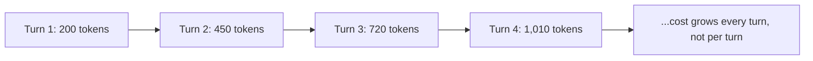

Every provider publishes a clean per-million-token price, and every finance team that's tried to forecast an AI line item from that number alone has been surprised at least once. The sticker price is real, but it's rarely what determines whether this month's bill looks like last month's.

{/* truncate */}

A note before the numbers: model pricing changes often enough — new model generations, revised tiers, promotional rates — that publishing a specific price table here would be stale within weeks and potentially already wrong by the time you're reading this. The structural cost drivers below are far more stable, and understanding them matters more than memorizing a number that will change anyway. Check your provider's pricing page for current rates.

## Output tokens cost more than input tokens, consistently

Across every major provider, generation (output) pricing runs meaningfully higher than input pricing — commonly in the 3–5x range, sometimes more for reasoning-heavy models where the model generates hidden reasoning tokens you're billed for but never see. This means the naive mental model — "a request costs roughly $X per thousand words" — is wrong in a specific, predictable direction: a prompt that asks for a longer response costs disproportionately more than a prompt that asks a longer question.

## Multi-turn conversations bill the whole history, every turn

The part that catches teams off guard first: most chat completion APIs are stateless per call, which means every turn in a conversation resends the entire prior conversation as input tokens. Turn 10 of a support conversation isn't billed for "one more message" — it's billed for the full accumulated transcript, system prompt included. A conversation that feels lightweight to the end user can be quietly re-billing thousands of input tokens on every single reply.

This is where prompt caching (discounted pricing for input tokens repeated across consecutive calls, offered by most major providers now) earns its keep — it specifically targets this pattern, since the growing conversation history is exactly the kind of repeated prefix caching is built for.

## Retries and tool loops multiply, they don't add

An agent that calls a tool, evaluates the result, and calls the model again isn't one request — it's N requests, and if there's a retry-on-failure loop with no cap, a single user action can trigger an unbounded number of calls. This is the single most common cause of a "why did yesterday cost 4x a normal day" incident, and it's very rarely a pricing change — it's almost always a loop that didn't terminate the way it was supposed to.

## Batch and caching discounts exist and are usually left on the table

Most providers offer meaningfully discounted pricing for asynchronous batch processing (commonly 50% off) and for cached/repeated input tokens (commonly a fraction of the base input rate). Neither applies automatically — batch requires routing non-latency-sensitive work through a separate API path, and caching requires structuring prompts so the repeated portion (system prompt, few-shot examples, conversation history) actually stays identical across calls instead of being reconstructed slightly differently each time.

## The actual fix isn't a cheaper model

Model selection matters, but the bigger lever in practice is usually: cap conversation history length or summarize old turns instead of resending them raw, cap agent/tool-call loops with a hard maximum, structure prompts so caching can actually apply, and route anything non-interactive through batch pricing. A team that does all four often sees a larger cost reduction than a team that only swaps to a cheaper model and changes nothing else about how requests are shaped.
