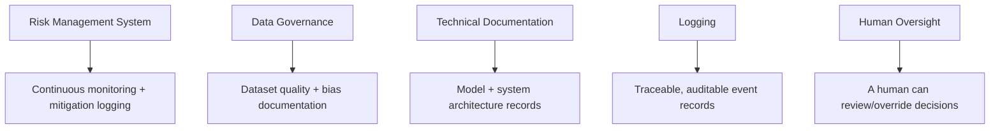

The EU AI Act gets covered extensively from a legal and policy angle, and much less from the angle of "okay, but what does my team actually have to build." This is the second version — what the requirements translate to as engineering work, not statute text.

{/* truncate */}

A caveat up front: the Act's implementation timeline has moved more than once, including a political agreement reached in May 2026 that pushed key high-risk obligations further out. Treat the dates below as a snapshot, not a guarantee — verify current deadlines against official EU sources before making a compliance timeline commitment.

## Who this actually applies to

The Act's obligations scale with risk classification, not with "are you using AI" in general. Most consumer-facing chat features and internal productivity tools fall into limited-risk or minimal-risk tiers with comparatively light obligations (mainly transparency — disclosing that a user is interacting with AI). The heavy engineering lift is reserved for **high-risk AI systems** — broadly, systems used in contexts like employment decisions, credit scoring, medical devices, critical infrastructure, and law enforcement, as enumerated in the Act's annexes. If your system isn't touching one of those categories, the practical burden is much lighter than the headlines suggest.

## What "high-risk" actually requires, translated to engineering tasks

- **Risk management system** → in practice, this means your system needs to log the kinds of events a risk assessment would want to review, and there needs to be an actual process for someone to look at that data periodically, not just infrastructure that could theoretically support it.
- **Data governance** → documentation of what data trained or informs the system's outputs, with attention to bias — this is more of a records-and-process requirement than a code change, but it depends on your logging being detailed enough to reconstruct what happened.
- **Technical documentation** → a real, maintained document describing the system's architecture, intended purpose, and limitations — the kind of thing engineering teams often have informally and need to formalize.
- **Logging** → this is the one most directly an infrastructure requirement: high-risk systems need event logs detailed enough to reconstruct decisions after the fact, over a retention period. An immutable, queryable audit trail is directly load-bearing here, not a nice-to-have.
- **Human oversight** → the system needs a designed path for a human to review or override an automated decision — an architectural requirement (there has to be a review step that actually functions) more than a pure logging one.

## The practical starting point

For most engineering teams, the highest-leverage first move regardless of final timeline is auditability: can you reconstruct, for any given decision your AI system made, what data went in, what model made the call, and who (if anyone) reviewed it? That capability is required by essentially every version of the high-risk obligations that's been proposed, it's useful independent of EU regulation specifically (a lot of other jurisdictions are converging on similar logging expectations), and it's the piece that takes the longest to retrofit if you build it as an afterthought instead of a pipeline stage from the start.

The version of this that's easy to get wrong: treating it as a documentation exercise to complete once, rather than a property the system needs to maintain continuously as it changes. A risk assessment written for last year's model version doesn't cover this year's fine-tune.
