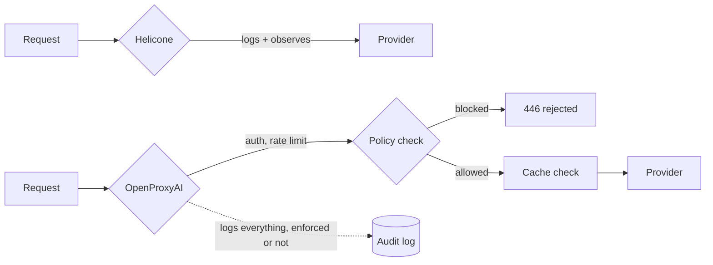

Helicone comes up constantly in the same breath as OpenProxyAI, and it should — both sit in the request path between your app and your model provider, both log every call, both give you cost visibility. The difference isn't "better" or "worse." It's what each one assumes is the primary job.

{/* truncate */}

## What Helicone actually is

Helicone started as — and is still primarily — an observability platform for LLM calls. You point your traffic through it (via proxy or async logging), and you get request/response logs, latency and cost dashboards, prompt experimentation tooling, and session tracing. It's a genuinely good product at that job: if your question is "what is my LLM traffic actually doing right now," Helicone answers it well, with a lighter integration lift than most alternatives.

## What OpenProxyAI actually is

OpenProxyAI starts from a different question: "what is my LLM traffic *allowed* to do." Observability is a stage in the pipeline, not the product — every request also passes through policy enforcement (PII redaction, secrets scanning, topic guards, prompt-injection scoring), budget checks, and semantic caching before it ever reaches a provider. The audit log is a byproduct of that enforcement being immutable, not a separate feature bolted on afterward.

## Where the two diverge in practice

- **Enforcement vs. visibility.** Helicone will show you that a request contained something it shouldn't have — after the fact. OpenProxyAI can block, redact, or route around it before the provider ever sees it. If your compliance requirement is "we need to know," Helicone covers it. If it's "we need to prevent it," it doesn't, by design.
- **Budgets.** OpenProxyAI enforces per-team, per-model, per-dollar-per-day budgets as a hard gate (HTTP 402 when exceeded). Helicone's cost tooling is reporting-oriented — you see the spend, but stopping it requires building that logic yourself.
- **Deployment model.** Helicone offers both a cloud SaaS and self-hosted option. OpenProxyAI is self-hosted-first — it assumes your provider keys and request bodies stay inside your VPC by default, not as an enterprise upgrade.
- **Compliance templates.** Healthcare, Finance, and Government policy templates are native to OpenProxyAI's policy engine. Helicone doesn't have an equivalent, because policy enforcement isn't the product surface it's built around.

## Where Helicone is the better call

If you already have your own routing, rate limiting, and guardrails — or you genuinely don't need them yet — and what's missing is *visibility*, Helicone's prompt experimentation and session-replay tooling is more mature than anything OpenProxyAI ships for that specific job. Plenty of teams run Helicone in front of a homegrown router purely for the observability layer, and that's a completely reasonable setup.

The honest split: Helicone if you need to see what's happening. OpenProxyAI if you need something with the authority to say no.
