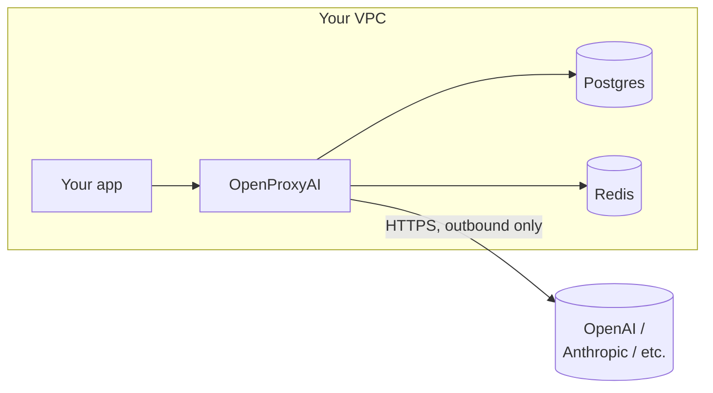

Most AI gateways you'll evaluate are built SaaS-first: a multi-tenant service you send your traffic to, with a self-hosted or "VPC" option available if you pay for the enterprise tier. OpenProxyAI is built the other way around. Self-hosted is the default, not the upsell.

That ordering isn't a licensing decision. It changes what you're actually agreeing to when you adopt the tool.

{/* truncate */}

## The question a SaaS gateway can't answer cleanly

If your proxy is a multi-tenant SaaS product, every request your organization sends passes through infrastructure someone else operates. That's fine for a lot of tools. It's a much harder sell when the traffic is prompts containing customer PII, internal financial data, or anything else your compliance team has opinions about — because now the question isn't just "does this vendor have good security practices," it's "which of our regulatory obligations just became partially their responsibility."

A self-hosted-by-default proxy sidesteps the question entirely. The service runs on infrastructure *you* control — your VPC, your Postgres, your Redis. There's no data plane operated by us that your requests need to trust.

## What this actually looks like

The only thing that leaves your network is the outbound call to whichever model provider you've configured — the same call your application would make directly, just routed through policy enforcement and logging first. There's no OpenProxyAI-operated service in the request path at all.

## The trade-off, honestly

Self-hosted-first isn't free. You're running a service, which means you own its uptime, its scaling, and its patching cadence — that's real operational weight a managed SaaS product takes off your plate. If you'd rather not carry that, the hosted Starter and Growth plans exist for exactly that reason.

But for the buyer this actually matters to — a security team evaluating whether prompts containing regulated data are allowed to leave the building — self-hosted-first isn't a nice-to-have. It's the reason the tool clears procurement at all.

See [Deploying with Docker Compose](/guides/deploying-with-docker-compose) or [Deploying with Helm](/guides/deploying-with-helm) to see what actually running it looks like.
