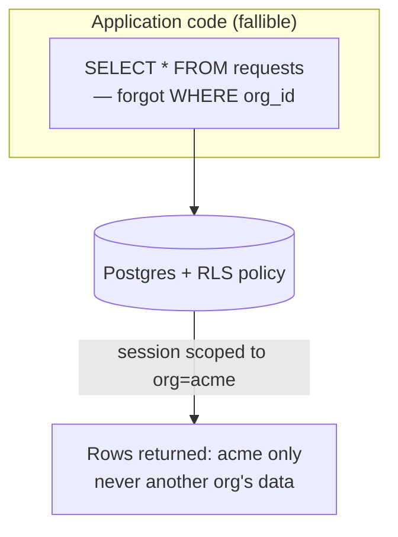

Every multi-tenant system has to answer the same question: what stops a bug in organization A's code path from returning organization B's data? The conventional answer is discipline — every query gets a `WHERE org_id = ?` clause, added by convention, reviewed in code review, hopefully never forgotten.

We didn't want the answer to be discipline. We wanted it to be a database property that doesn't care whether the application code remembered.

{/* truncate */}

## Where the application-level approach breaks

`WHERE org_id = ?` is a pattern, not a guarantee. It's only as strong as the least careful query in the codebase — one join that forgets the clause, one raw SQL escape hatch during a migration, one new engineer who doesn't know the convention yet. When it breaks, it doesn't throw an error. It just quietly returns rows that belong to someone else's organization. That's close to the worst possible failure mode for a security bug: silent, and only discovered when someone notices data that shouldn't be there.

## What row-level security changes

PostgreSQL's row-level security (RLS) moves the boundary into the database itself. Every table that holds organization-scoped data has a policy that filters rows based on a session-level variable — set once, at the start of a database session, before any query runs.

The critical property: a query that forgets to filter by organization doesn't leak the wrong rows. It returns *no* rows for anything outside its session's scope, because the database enforces the boundary independently of what the query asked for. The failure mode changes from "silently wrong" to "safely empty" — which is the difference between a data breach and a bug report.

## The part that's easy to get wrong

RLS only works if every code path that touches the database actually sets the session's org context before querying. That's straightforward in the request path — one middleware call at the start of every request. It's less obvious for background jobs: log archival, webhook retries, scheduled analytics refreshes all run outside the request-response cycle, on their own schedule, sometimes across every organization in a single sweep. Each of those has to open its own database session and explicitly scope it, rather than assuming a request-scoped session it can borrow — because there isn't one to borrow from.

Get that part right and the guarantee holds everywhere, not just in the code paths someone thought to test.

More detail on the actual policy mechanics in [Row-Level Security](/security/row-level-security).
