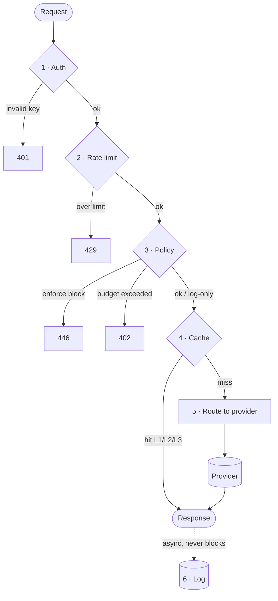

"Adds a few milliseconds of overhead" is the kind of line that shows up in every proxy's marketing copy, ours included. It's true, but it undersells what's actually happening in that window. Six things happen, in a specific order, and the order is load-bearing — get it wrong and you either leak data you meant to redact, or you pay for cache infrastructure you can't actually use.

{/* truncate */}

## The pipeline

## Why the order isn't arbitrary

**Auth and rate limiting come first** because there's no point doing any other work — redacting PII, checking a cache — for a request you're about to reject anyway. Reject cheap failures as early as possible.

**Policy runs before cache, not after.** This is the one that actually matters. If a request contains PII and policy redaction ran *after* the cache check, the cache key would be built from the raw, unredacted content — which means the cached entry itself could contain the PII that was supposed to be stripped. Running policy first means the cache only ever sees the already-redacted version. The cache can't leak something it never saw.

**Cache comes before routing** for the obvious reason: a cache hit means there's no routing decision to make at all. The request never reaches the provider-selection logic, because it never reaches a provider.

**Logging is the only stage that happens after the response is sent, not before.** Every other stage can reject or delay the request. Logging can't — it's fire-and-forget, written asynchronously once the response has already gone back to the caller. A slow or temporarily unavailable logging backend should never be the reason your application's request takes longer.

## What this costs in practice

Stages 1–3 and 5–6 typically add low-single-digit milliseconds combined — the actual overhead is dominated by whichever provider you're calling, not by OpenProxyAI. A cache hit at stage 4 doesn't add latency at all; it *replaces* the provider round-trip entirely, which is usually hundreds of milliseconds saved, not spent.

The four milliseconds aren't overhead you're paying for nothing. They're the four milliseconds where redaction, budget enforcement, and cache-key correctness all have to happen in the right order — before the request goes anywhere you can't take it back from.

Full detail on each stage in [Request Pipeline](/core-concepts/request-pipeline).
