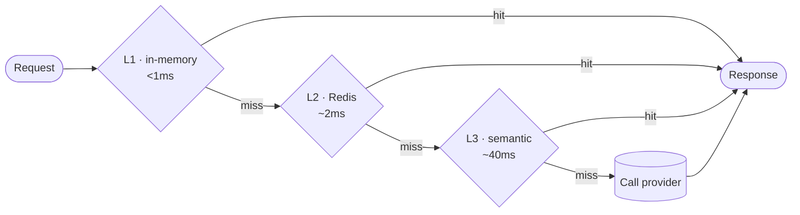

# Caching

OpenProxyAI checks a 3-tier cache before calling a provider. Tiers are checked in order; the first hit wins.

## L1 — In-memory

A per-instance TTL cache. Matches on exact request content. Sub-millisecond hits, but scoped to a single proxy process — a hit on one instance doesn't help a request that lands on another.

## L2 — Redis

A shared cache across every proxy instance. Also an exact-match cache, but hits survive process restarts and are visible to every instance behind your load balancer.

## L3 — Semantic (pgvector)

The request is embedded and compared by similarity against previously cached requests, rather than requiring an exact text match. This catches paraphrased or reworded prompts that L1/L2 would treat as entirely new requests. Backed by Postgres with the `pgvector` extension.

## Overriding cache behavior per request

Cache behavior can be overridden per request with a header — for example, to force a bypass on a request you know should never be cached (data that's expected to change between calls). Check the [API Reference](/api-reference/chat-completions) for the current header name and accepted values.

## What gets cached

The cache key is derived from the (post-redaction) request content — model, messages, and relevant parameters. Policy redaction happens *before* the cache check, so a cached entry never contains the raw PII that was stripped from the original request.

## Cache metrics

Cache hit rate and tier breakdown are available per-organization via `/api/v1/analytics/cache`, and surfaced in the admin console dashboard.
