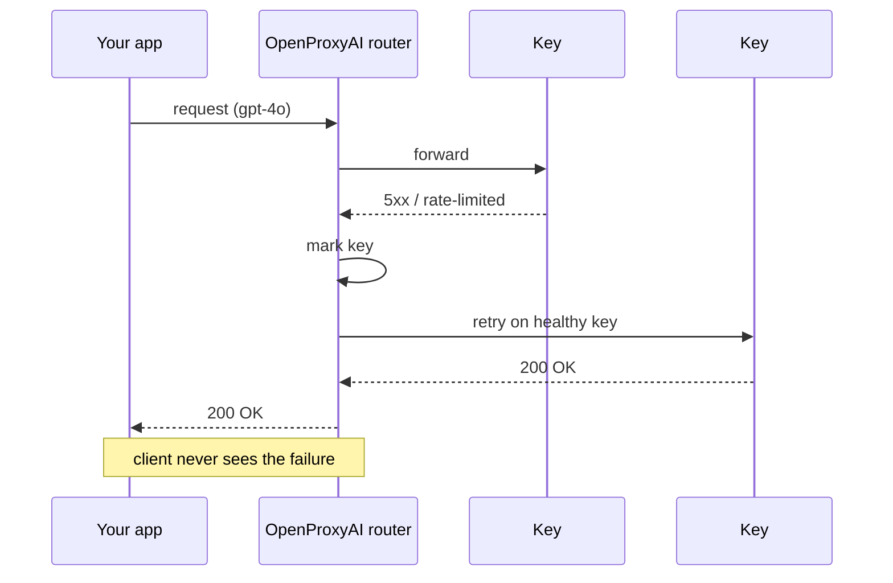

# Provider Routing

OpenProxyAI routes each request to a provider using weighted rotation across the provider keys you've configured for that model.

## Multiple keys per provider

You can register more than one key for the same provider — for example, two OpenAI keys with different rate-limit tiers, or keys scoped to different regions. Each key is weighted independently; a key with weight `0.7` receives roughly 70% of traffic for that provider relative to its siblings.

## Failover

If a provider key is rate-limited, erroring, or has failed recent health checks, the router shifts traffic to the remaining healthy keys automatically. This happens without any client-side retry logic — your application sees a single successful response.

## Data residency

Provider keys can be tagged with a `data_region`. When an organization has a residency requirement, routing is filtered to only the provider keys whose region satisfies it, so a request never leaves the approved region even under failover. See [Data Residency](/guides/data-residency).

## Adaptive routing

With `ADAPTIVE_LB_ENABLED` set, the router adjusts effective weights based on observed latency rather than relying solely on the static configured weights — see [Environment Flags](/getting-started/environment-flags).

## Managing provider keys

Provider keys are managed via `/api/v1/provider-keys` (list/create), `/api/v1/provider-keys/{key_id}` (update/delete), and rotated via `/api/v1/provider-keys/{key_id}/rotate`. See the [API Reference](/api-reference/provider-keys).
