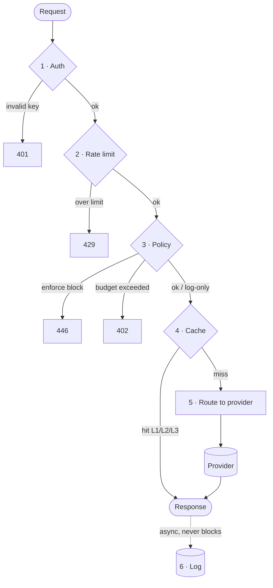

# Request Pipeline

Every request to `/v1/chat/completions` or `/v1/embeddings` passes through the same six stages, in order, before OpenProxyAI calls a provider.

## 1. Auth

The bearer API key is verified and resolved to an organization, and — if the key is team-scoped — a team. Requests with a missing or invalid key are rejected before any other work happens.

## 2. Rate limit

Three limits are checked together: requests per minute, tokens per minute, and dollars per day. A request that exceeds any of them is rejected with `429`. See [Rate Limiting & Budgets](/core-concepts/rate-limiting-and-budgets).

## 3. Policy

Guardrail policies named in the `x-op-policy` header (or configured as defaults for the team) run against the request. This includes PII redaction, secrets scanning, topic guarding, and prompt-injection detection. A request blocked by an `enforce`-mode policy returns `446`; `log-only` policies record a hit but let the request through. See [Policies & Guardrails](/core-concepts/policies-and-guardrails).

## 4. Cache

The (possibly redacted) request is checked against the 3-tier cache — L1 in-memory, L2 Redis, L3 semantic — in that order. A hit short-circuits the pipeline and returns immediately, skipping the provider call entirely. See [Caching](/core-concepts/caching).

## 5. Route

On a cache miss, the request is routed to a provider using weighted rotation across your configured provider keys for that model, with automatic failover if a key is unhealthy or rate-limited upstream. See [Provider Routing](/core-concepts/provider-routing).

## 6. Log

The request, the policy decisions made, the routing decision, and the final cost are written asynchronously after the response is returned. Logging never blocks or slows down the response to your application.

## Custom status codes

| Code | Meaning |
|---|---|
| `402` | Budget exceeded |
| `429` | Rate limit hit |
| `446` | Blocked by an enforcing policy |

Full list in [Errors & Status Codes](/api-reference/errors-and-status-codes).

## Overhead

Stages 1–3 and 5–6 typically add a few milliseconds of overhead on top of the provider's own latency; a cache hit at stage 4 replaces the entire provider round-trip.
