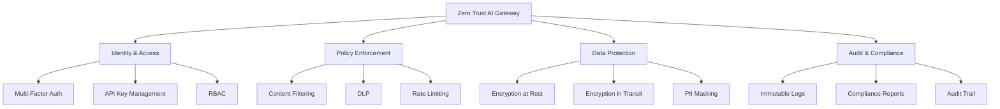
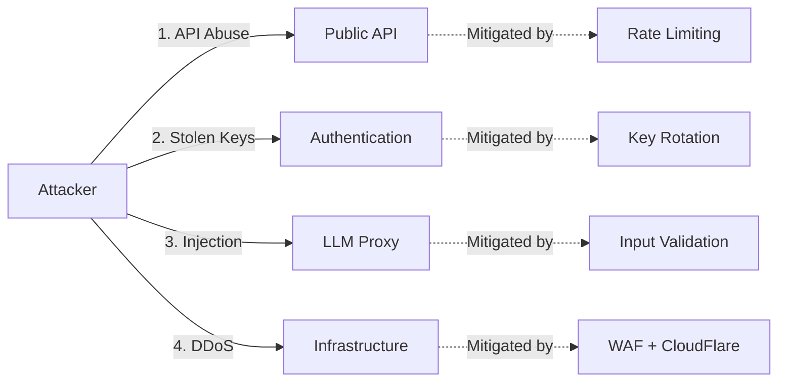
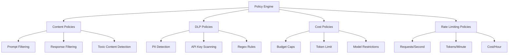

# Security & Compliance Architecture

**OpenProxyAI - Security-First LLM Gateway**

---

## 📋 Table of Contents

1. [Security Overview](#security-overview)
2. [Threat Model](#threat-model)
3. [Authentication & Authorization](#authentication--authorization)
4. [Policy Enforcement Engine](#policy-enforcement-engine)
5. [Data Protection](#data-protection)
6. [Audit & Compliance Logging](#audit--compliance-logging)
7. [Network Security](#network-security)
8. [Compliance Frameworks](#compliance-frameworks)
9. [Security Operations](#security-operations)
10. [Incident Response](#incident-response)

---

## 🛡️ Security Overview

### Core Security Principles

OpenProxyAI is built on **Zero Trust Architecture** for enterprise AI:

```
🔒 NEVER TRUST, ALWAYS VERIFY

Every request is:
- ✅ Authenticated (Who are you?)
- ✅ Authorized (What can you do?)
- ✅ Audited (What did you do?)
- ✅ Encrypted (Protect in transit & at rest)
```

### Security Pillars



### Defense in Depth

```
┌─────────────────────────────────────────────────────────────┐
│ Layer 7: Compliance & Auditing (SOC 2, HIPAA, GDPR)        │
├─────────────────────────────────────────────────────────────┤
│ Layer 6: Policy Enforcement (Content Filtering, DLP)        │
├─────────────────────────────────────────────────────────────┤
│ Layer 5: Application Security (Input Validation, Rate Limit)│
├─────────────────────────────────────────────────────────────┤
│ Layer 4: Authorization (RBAC, Policies)                     │
├─────────────────────────────────────────────────────────────┤
│ Layer 3: Authentication (API Keys, OAuth, SSO)              │
├─────────────────────────────────────────────────────────────┤
│ Layer 2: Network Security (TLS 1.3, mTLS, Firewall)        │
├─────────────────────────────────────────────────────────────┤
│ Layer 1: Infrastructure (Encrypted Disks, Private Networks) │
└─────────────────────────────────────────────────────────────┘
```

---

## 🎯 Threat Model

### Attack Surface Analysis

#### 1. **External Attack Vectors**



**Threats:**

| Threat | Severity | Likelihood | Mitigation |
|--------|----------|-----------|------------|
| API key theft | **Critical** | High | Short-lived keys, rotation, IP allowlisting |
| Prompt injection | **High** | Medium | Input sanitization, content filtering |
| Data exfiltration | **Critical** | Low | DLP policies, audit logs, encryption |
| DDoS | **High** | Medium | Rate limiting, WAF, CDN |
| Credential stuffing | **Medium** | High | MFA, account lockout, CAPTCHA |

#### 2. **Insider Threats**

```
Employee/Contractor Risks:
- 🚨 Accidental data exposure (misconfigured policies)
- 🚨 Malicious data theft (access logs detect this)
- 🚨 Over-privileged accounts (least privilege by default)

Mitigations:
✅ Role-based access control (RBAC)
✅ Just-in-time (JIT) admin access
✅ Comprehensive audit logging
✅ Anomaly detection on access patterns
✅ Background checks for employees
```

#### 3. **Supply Chain Attacks**

```
Dependencies at Risk:
- 📦 Python packages (LiteLLM, FastAPI dependencies)
- 📦 Docker base images
- 📦 LLM provider SDKs

Mitigations:
✅ Pin all dependency versions
✅ Use Dependabot for updates
✅ Scan containers with Trivy/Snyk
✅ Private Docker registry for prod
✅ Verify checksums for critical deps
```

#### 4. **LLM-Specific Threats (OWASP Top 10)**

| OWASP LLM Risk | OpenProxyAI Mitigation |
|----------------|------------------------|
| **LLM01: Prompt Injection** | Input sanitization, system prompt isolation, content filtering |
| **LLM02: Insecure Output** | Output validation, PII masking, toxic content filtering |
| **LLM03: Training Data Poisoning** | N/A (we proxy, don't train) |
| **LLM04: Model Denial of Service** | Rate limiting, cost caps, request timeouts |
| **LLM05: Supply Chain** | Dependency scanning, version pinning |
| **LLM06: Sensitive Information Disclosure** | DLP policies, PII detection, audit logs |
| **LLM07: Insecure Plugin Design** | N/A (Phase 3+) |
| **LLM08: Excessive Agency** | Fine-grained permissions, approval workflows |
| **LLM09: Overreliance** | User education, output disclaimers |
| **LLM10: Model Theft** | N/A (we proxy, don't expose) |

---

## 🔐 Authentication & Authorization

### Authentication Methods

#### 1. **API Key Authentication** (Primary)

```python
# API Key Format
PREFIX: "opai_"  # OpenProxyAI identifier
ENVIRONMENT: "dev_" | "prod_"  # Environment indicator
KEY_ID: 8 chars  # Key identifier (for rotation tracking)
SECRET: 32 chars  # Cryptographically random
CHECKSUM: 4 chars  # Integrity check

# Example:
opai_prod_a3f8k2m9_x7y4w9z2q5t8p3n6m1k4h7j2c9v5b8  # Production key
opai_dev_9k2m4n7p_r4t6y8u9i1o3p5a7s9d1f3g5h7j9  # Development key
```

**Implementation:**

```python
# API Key Generation
import secrets
import hashlib
from datetime import datetime, timedelta

class APIKeyService:
    
    @staticmethod
    def generate_key(environment: str = "prod") -> dict:
        """Generate a new API key with metadata."""
        
        # Generate components
        prefix = "opai"
        env = f"{environment}_"
        key_id = secrets.token_hex(4)  # 8 chars
        secret = secrets.token_hex(16)  # 32 chars
        
        # Compute checksum
        raw = f"{prefix}_{env}{key_id}_{secret}"
        checksum = hashlib.sha256(raw.encode()).hexdigest()[:4]
        
        # Final key
        api_key = f"{prefix}_{env}{key_id}_{secret}{checksum}"
        
        # Hash for storage (only store hashes!)
        key_hash = hashlib.sha256(api_key.encode()).hexdigest()
        
        return {
            "api_key": api_key,  # Show once, then discard
            "key_hash": key_hash,  # Store in DB
            "key_id": key_id,  # For rotation tracking
            "environment": environment,
            "created_at": datetime.utcnow(),
            "expires_at": datetime.utcnow() + timedelta(days=90),
        }
    
    @staticmethod
    def validate_key(api_key: str, stored_hash: str) -> bool:
        """Validate API key against stored hash."""
        
        # Constant-time comparison
        key_hash = hashlib.sha256(api_key.encode()).hexdigest()
        return secrets.compare_digest(key_hash, stored_hash)
```

**Security Properties:**

✅ **High Entropy:** 256-bit randomness  
✅ **Prefix:** Easy to identify in code/logs  
✅ **Environment Separation:** Prevent dev/prod confusion  
✅ **Rotation Tracking:** Key ID for audit trails  
✅ **Checksum:** Detect typos/corruption  
✅ **Hashed Storage:** Never store plaintext  
✅ **Expiration:** Force rotation (90 days default)

#### 2. **OAuth 2.0 / OIDC** (Enterprise SSO)

```python
# OAuth Configuration (Enterprise Tier)
from fastapi import Depends, HTTPException
from fastapi.security import OAuth2AuthorizationCodeBearer

oauth2_scheme = OAuth2AuthorizationCodeBearer(
    authorizationUrl="https://auth.openproxyai.com/oauth/authorize",
    tokenUrl="https://auth.openproxyai.com/oauth/token",
)

# Supported Providers
SUPPORTED_PROVIDERS = [
    "okta",
    "auth0",
    "azure_ad",
    "google_workspace",
    "onelogin",
]

# SSO Integration Example
async def authenticate_sso(
    token: str = Depends(oauth2_scheme),
    db: Session = Depends(get_db),
) -> User:
    """Authenticate user via SSO provider."""
    
    # Verify token with provider
    user_info = await verify_oauth_token(token)
    
    # Map to internal user
    user = db.query(User).filter(User.email == user_info["email"]).first()
    
    if not user:
        raise HTTPException(status_code=401, detail="User not found")
    
    return user
```

**SAML 2.0 Support (Enterprise):**

```yaml
# SAML Configuration
saml:
  entity_id: "https://openproxyai.com"
  assertion_consumer_service: "https://api.openproxyai.com/auth/saml/acs"
  single_logout_service: "https://api.openproxyai.com/auth/saml/slo"
  
  # Supported IDPs
  identity_providers:
    - name: "Okta"
      metadata_url: "https://customer.okta.com/app/metadata"
    - name: "Azure AD"
      metadata_url: "https://login.microsoftonline.com/tenant/metadata"
```

#### 3. **Service Accounts** (Machine-to-Machine)

```python
# Service Account Keys (Non-expiring, rotatable)
class ServiceAccountKey:
    """
    Long-lived keys for automated systems.
    """
    
    key_format = "opai_sa_<service_name>_<key_id>_<secret>"
    
    # Example:
    # opai_sa_prod_datadog_4k8m2n7p_x3y5z8a2c4e6g8i0k2m4n6p8
    
    features = [
        "Non-expiring (manual rotation required)",
        "Associated with service account, not user",
        "Limited to specific scopes (read-only metrics, etc.)",
        "Require admin approval to create",
        "Audit log for all usage",
    ]
```

### Authorization (RBAC)

#### Role Definitions

```python
from enum import Enum

class Role(str, Enum):
    """User roles with hierarchical permissions."""
    
    # Basic Roles
    VIEWER = "viewer"  # Read-only access
    DEVELOPER = "developer"  # Create API keys, view analytics
    ADMIN = "admin"  # Full org management
    
    # Service Roles
    SERVICE_ACCOUNT = "service_account"  # Automated systems
    
    # Super Admin (OpenProxyAI staff only)
    SUPERADMIN = "superadmin"  # Cross-org access for support
```

#### Permission Matrix

```python
PERMISSIONS = {
    "viewer": [
        "read:analytics",
        "read:audit_logs",
    ],
    
    "developer": [
        "read:analytics",
        "read:audit_logs",
        "create:api_keys",
        "delete:api_keys",
        "proxy:llm",  # Make LLM requests
    ],
    
    "admin": [
        "*:analytics",
        "*:audit_logs",
        "*:api_keys",
        "*:policies",
        "*:users",
        "*:billing",
        "proxy:llm",
    ],
    
    "service_account": [
        "proxy:llm",  # Limited to LLM requests only
        "read:analytics",  # Read own usage
    ],
    
    "superadmin": ["*:*"],  # All permissions (use sparingly!)
}
```

#### Implementation

```python
from functools import wraps
from fastapi import HTTPException

def require_permission(permission: str):
    """Decorator to enforce permission checks."""
    
    def decorator(func):
        @wraps(func)
        async def wrapper(*args, current_user: User, **kwargs):
            # Check if user has permission
            if not current_user.has_permission(permission):
                raise HTTPException(
                    status_code=403,
                    detail=f"Missing required permission: {permission}",
                )
            
            return await func(*args, current_user=current_user, **kwargs)
        
        return wrapper
    return decorator

# Usage Example
@app.post("/api/v1/policies")
@require_permission("create:policies")
async def create_policy(
    policy: PolicyCreate,
    current_user: User = Depends(get_current_user),
):
    """Create new policy (admin only)."""
    pass
```

---

## 🚦 Policy Enforcement Engine

### Policy Types



### 1. Content Filtering Policies

```python
# Content Policy Configuration
from pydantic import BaseModel
from typing import List, Optional

class ContentPolicy(BaseModel):
    """Define content filtering rules."""
    
    id: str
    name: str
    organization_id: str
    enabled: bool = True
    
    # Prompt filtering
    blocked_keywords: List[str] = []
    blocked_patterns: List[str] = []  # Regex patterns
    
    # Response filtering
    max_response_length: Optional[int] = None
    block_toxic_content: bool = True
    toxicity_threshold: float = 0.7  # 0.0-1.0
    
    # Actions
    on_violation: str = "block"  # "block" | "warn" | "audit_only"
    

# Example Policies
EXAMPLE_POLICIES = [
    ContentPolicy(
        id="policy_001",
        name="Healthcare HIPAA Compliance",
        blocked_keywords=["ssn", "medical record number", "patient id"],
        block_toxic_content=True,
        on_violation="block",
    ),
    
    ContentPolicy(
        id="policy_002",
        name="Financial Regulation",
        blocked_patterns=[
            r"\b\d{3}-\d{2}-\d{4}\b",  # SSN
            r"\b\d{16}\b",  # Credit card (simple)
        ],
        max_response_length=2000,
        on_violation="block",
    ),
]
```

**Implementation:**

```python
class PolicyEnforcer:
    """Enforce content policies on LLM requests."""
    
    def __init__(self, policies: List[ContentPolicy]):
        self.policies = policies
    
    async def check_prompt(self, prompt: str) -> PolicyResult:
        """Check if prompt violates any policy."""
        
        violations = []
        
        for policy in self.policies:
            if not policy.enabled:
                continue
            
            # Check blocked keywords
            for keyword in policy.blocked_keywords:
                if keyword.lower() in prompt.lower():
                    violations.append({
                        "policy_id": policy.id,
                        "rule": "blocked_keyword",
                        "matched": keyword,
                    })
            
            # Check regex patterns
            import re
            for pattern in policy.blocked_patterns:
                if re.search(pattern, prompt, re.IGNORECASE):
                    violations.append({
                        "policy_id": policy.id,
                        "rule": "blocked_pattern",
                        "matched": pattern,
                    })
        
        if violations:
            return PolicyResult(
                allowed=False,
                violations=violations,
                action="block",
            )
        
        return PolicyResult(allowed=True)
    
    async def check_response(self, response: str) -> PolicyResult:
        """Check if LLM response violates any policy."""
        
        violations = []
        
        for policy in self.policies:
            # Check response length
            if policy.max_response_length:
                if len(response) > policy.max_response_length:
                    violations.append({
                        "policy_id": policy.id,
                        "rule": "max_response_length",
                        "matched": len(response),
                    })
            
            # Check toxicity (if enabled)
            if policy.block_toxic_content:
                toxicity_score = await self._check_toxicity(response)
                if toxicity_score > policy.toxicity_threshold:
                    violations.append({
                        "policy_id": policy.id,
                        "rule": "toxic_content",
                        "score": toxicity_score,
                    })
        
        if violations:
            return PolicyResult(
                allowed=False,
                violations=violations,
                action="block",
            )
        
        return PolicyResult(allowed=True)
    
    async def _check_toxicity(self, text: str) -> float:
        """Check text toxicity using PerspectiveAPI or similar."""
        # Implementation: Call external toxicity API
        # For MVP: Use simple keyword matching
        toxic_keywords =["hate", "violence", "explicit"]
        matches = sum(1 for kw in toxic_keywords if kw in text.lower())
        return min(matches / len(toxic_keywords), 1.0)
```

### 2. DLP (Data Loss Prevention) Policies

```python
# DLP Policy for PII Detection
class DLPPolicy(BaseModel):
    """Detect and prevent sensitive data leakage."""
    
    id: str
    name: str
    organization_id: str
    enabled: bool = True
    
    # PII Detection Rules
    detect_ssn: bool = True
    detect_credit_card: bool = True
    detect_email: bool = True
    detect_phone: bool = True
    detect_ip_address: bool = False
    
    # Custom Patterns
    custom_patterns: List[dict] = []
    
    # Actions
    on_detection: str = "mask"  # "mask" | "block" | "alert"
    mask_char: str = "X"


# DLP Implementation
import re

class DLPDetector:
    """Detect PII and sensitive data."""
    
    PATTERNS = {
        "ssn": r"\b\d{3}-\d{2}-\d{4}\b",
        "credit_card": r"\b\d{4}[- ]?\d{4}[- ]?\d{4}[- ]?\d{4}\b",
        "email": r"\b[A-Za-z0-9._%+-]+@[A-Za-z0-9.-]+\.[A-Z|a-z]{2,}\b",
        "phone": r"\b(\+\d{1,3}[- ]?)?\(?\d{3}\)?[- ]?\d{3}[- ]?\d{4}\b",
        "ip_address": r"\b\d{1,3}\.\d{1,3}\.\d{1,3}\.\d{1,3}\b",
        "api_key": r"\b(opai_|sk-)[A-Za-z0-9_-]{20,}\b",
    }
    
    def __init__(self, policy: DLPPolicy):
        self.policy = policy
    
    def scan(self, text: str) -> DLPResult:
        """Scan text for PII."""
        
        detections = []
        
        # Check each pattern
        for pii_type, pattern in self.PATTERNS.items():
            # Skip if disabled in policy
            if not getattr(self.policy, f"detect_{pii_type}", True):
                continue
            
            matches = re.finditer(pattern, text)
            for match in matches:
                detections.append({
                    "type": pii_type,
                    "value": match.group(),
                    "start": match.start(),
                    "end": match.end(),
                })
        
        return DLPResult(
            detections=detections,
            text=text,
        )
    
    def mask(self, text: str, detections: List[dict]) -> str:
        """Mask detected PII in text."""
        
        masked_text = text
        
        # Mask from end to start (preserve indices)
        for detection in sorted(detections, key=lambda d: d["start"], reverse=True):
            start = detection["start"]
            end = detection["end"]
            value = detection["value"]
            
            # Mask with X's (preserve last 4 for partial visibility)
            if len(value) > 4:
                masked = self.policy.mask_char * (len(value) - 4) + value[-4:]
            else:
                masked = self.policy.mask_char * len(value)
            
            masked_text = masked_text[:start] + masked + masked_text[end:]
        
        return masked_text
```

**Example DLP Flow:**

```python
# In LLM Proxy Endpoint
async def process_llm_request(request: LLMRequest):
    """Process LLM request with DLP checks."""
    
    # 1. Check for PII in prompt
    dlp_result = dlp_detector.scan(request.prompt)
    
    if dlp_result.detections:
        # Log detection
        await audit_logger.log({
            "event": "dlp_detection",
            "detections": dlp_result.detections,
            "action": policy.on_detection,
        })
        
        # Take action based on policy
        if policy.on_detection == "block":
            raise HTTPException(
                status_code=403,
                detail="Prompt contains sensitive data (DLP policy violation)",
            )
        
        elif policy.on_detection == "mask":
            # Mask PII before sending to LLM
            request.prompt = dlp_detector.mask(request.prompt, dlp_result.detections)
        
        elif policy.on_detection == "alert":
            # Allow but send alert
            await send_security_alert(dlp_result)
    
    # 2. Forward to LLM provider
    response = await llm_client.chat_completion(request)
    
    # 3. Check for PII in response
    response_dlp = dlp_detector.scan(response.content)
    if response_dlp.detections:
        response.content = dlp_detector.mask(response.content, response_dlp.detections)
    
    return response
```

### 3. Cost & Usage Policies

```python
class CostPolicy(BaseModel):
    """Enforce cost and usage limits."""
    
    id: str
    name: str
    organization_id: str
    enabled: bool = True
    
    # Budget Limits
    daily_budget: Optional[float] = None  # USD
    monthly_budget: Optional[float] = None  # USD
    
    # Token Limits
    max_tokens_per_request: Optional[int] = 4096
    max_tokens_per_user_daily: Optional[int] = None
    
    # Model Restrictions
    allowed_models: Optional[List[str]] = None
    disallowed_models: Optional[List[str]] = None
    
    # Actions
    on_violation: str = "block"  # "block" | "warn" | "downgrade"


# Cost Policy Enforcer
class CostPolicyEnforcer:
    """Enforce cost policies."""
    
    def __init__(self, policy: CostPolicy, cost_tracker: CostTracker):
        self.policy = policy
        self.cost_tracker = cost_tracker
    
    async def check_budget(self, org_id: str) -> PolicyResult:
        """Check if organization is within budget."""
        
        violations = []
        
        # Check daily budget
        if self.policy.daily_budget:
            today_spend = await self.cost_tracker.get_daily_spend(org_id)
            if today_spend >= self.policy.daily_budget:
                violations.append({
                    "rule": "daily_budget_exceeded",
                    "limit": self.policy.daily_budget,
                    "current": today_spend,
                })
        
        # Check monthly budget
        if self.policy.monthly_budget:
            month_spend = await self.cost_tracker.get_monthly_spend(org_id)
            if month_spend >= self.policy.monthly_budget:
                violations.append({
                    "rule": "monthly_budget_exceeded",
                    "limit": self.policy.monthly_budget,
                    "current": month_spend,
                })
        
        if violations:
            return PolicyResult(allowed=False, violations=violations)
        
        return PolicyResult(allowed=True)
    
    async def check_token_limit(self, request: LLMRequest) -> PolicyResult:
        """Check token limits."""
        
        violations = []
        
        # Check per-request limit
        if self.policy.max_tokens_per_request:
            if request.max_tokens > self.policy.max_tokens_per_request:
                violations.append({
                    "rule": "max_tokens_per_request",
                    "limit": self.policy.max_tokens_per_request,
                    "requested": request.max_tokens,
                })
        
        if violations:
            return PolicyResult(allowed=False, violations=violations)
        
        return PolicyResult(allowed=True)
    
    async def check_model_allowed(self, model: str) -> PolicyResult:
        """Check if model is allowed."""
        
        # Check allowlist
        if self.policy.allowed_models:
            if model not in self.policy.allowed_models:
                return PolicyResult(
                    allowed=False,
                    violations=[{
                        "rule": "model_not_allowed",
                        "model": model,
                        "allowed_models": self.policy.allowed_models,
                    }],
                )
        
        # Check denylist
        if self.policy.disallowed_models:
            if model in self.policy.disallowed_models:
                return PolicyResult(
                    allowed=False,
                    violations=[{
                        "rule": "model_disallowed",
                        "model": model,
                    }],
                )
        
        return PolicyResult(allowed=True)
```

---

## 🔒 Data Protection

### Encryption at Rest

```python
# Database Encryption Configuration
DATABASE_ENCRYPTION = {
    "provider": "PostgreSQL Transparent Data Encryption (TDE)",
    
    # For Azure Database for PostgreSQL
    "azure": {
        "method": "Customer-Managed Keys (CMK)",
        "key_vault": "Azure Key Vault",
        "key_rotation": "Automatic (every 90 days)",
        "algorithm": "AES-256",
    },
    
    # For self-hosted PostgreSQL
    "self_hosted": {
        "method": "pgcrypto extension",
        "key_management": "HashiCorp Vault",
        "key_rotation": "Manual (every 90 days)",
        "algorithm": "AES-256-GCM",
    },
}

# Column-Level Encryption for Sensitive Fields
from cryptography.fernet import Fernet

class EncryptionService:
    """Encrypt/decrypt sensitive fields."""
    
    def __init__(self, master_key: bytes):
        self.fernet = Fernet(master_key)
    
    def encrypt(self, plaintext: str) -> str:
        """Encrypt sensitive data."""
        return self.fernet.encrypt(plaintext.encode()).decode()
    
    def decrypt(self, ciphertext: str) -> str:
        """Decrypt sensitive data."""
        return self.fernet.decrypt(ciphertext.encode()).decode()

# Usage in Database Models
from sqlalchemy import Column, String
from sqlalchemy.types import TypeDecorator

class EncryptedString(TypeDecorator):
    """SQLAlchemy type for encrypted strings."""
    
    impl = String
    cache_ok = True
    
    def __init__(self, *args, **kwargs):
        super().__init__(*args, **kwargs)
        self.encryption_service = EncryptionService(get_master_key())
    
    def process_bind_param(self, value, dialect):
        """Encrypt before storing."""
        if value is not None:
            return self.encryption_service.encrypt(value)
        return value
    
    def process_result_value(self, value, dialect):
        """Decrypt after loading."""
        if value is not None:
            return self.encryption_service.decrypt(value)
        return value

# Model with Encrypted Fields
class APIKey(Base):
    __tablename__ = "api_keys"
    
    id = Column(String, primary_key=True)
    organization_id = Column(String, nullable=False)
    
    # Encrypted fields
    key_hash = Column(EncryptedString(255), nullable=False)  # Store encrypted hash
    
    # Plaintext fields
    key_id = Column(String(8), nullable=False)
    environment = Column(String(10), nullable=False)
    created_at = Column(DateTime, default=datetime.utcnow)
```

### Encryption in Transit

```yaml
# TLS Configuration
tls:
  minimum_version: "TLS 1.3"
  cipher_suites:
    - TLS_AES_256_GCM_SHA384
    - TLS_CHACHA20_POLY1305_SHA256
    - TLS_AES_128_GCM_SHA256
  
  # Certificate Management
  cert_provider: "Let's Encrypt"
  auto_renewal: true
  renewal_days_before_expiry: 30
  
  # mTLS for Service-to-Service
  mtls_enabled: true  # Enterprise tier
  client_cert_validation: "require"
  
# NGINX TLS Config
server {
    listen 443 ssl http2;
    server_name api.openproxyai.com;
    
    # TLS 1.3 only
    ssl_protocols TLSv1.3;
    ssl_prefer_server_ciphers off;
    
    # Certificates
    ssl_certificate /etc/letsencrypt/live/openproxyai.com/fullchain.pem;
    ssl_certificate_key /etc/letsencrypt/live/openproxyai.com/privkey.pem;
    
    # HSTS
    add_header Strict-Transport-Security "max-age=31536000; includeSubDomains" always;
    
    # Security headers
    add_header X-Frame-Options "DENY" always;
    add_header X-Content-Type-Options "nosniff" always;
    add_header X-XSS-Protection "1; mode=block" always;
    add_header Referrer-Policy "strict-origin-when-cross-origin" always;
}
```

### PII Masking & Anonymization

```python
# PII Masking for Logs & Analytics
class PIIMasker:
    """Mask PII before logging."""
    
    @staticmethod
    def mask_email(email: str) -> str:
        """Mask email address."""
        # user@example.com -> u***r@example.com
        local, domain = email.split("@")
        if len(local) > 2:
            masked_local = local[0] + "***" + local[-1]
        else:
            masked_local = "***"
        return f"{masked_local}@{domain}"
    
    @staticmethod
    def mask_ip(ip: str) -> str:
        """Mask IP address."""
        # 192.168.1.100 -> 192.168.XXX.XXX
        parts = ip.split(".")
        return f"{parts[0]}.{parts[1]}.XXX.XXX"
    
    @staticmethod
    def mask_api_key(key: str) -> str:
        """Mask API key."""
        # opai_prod_a3f8k2m9_ ... -> opai_prod_****last4
        if len(key) > 4:
            return key[:10] + "****" + key[-4:]
        return "****"

# Usage in Audit Logger
async def log_request(request: LLMRequest, user: User):
    """Log request with PII masked."""
    
    await audit_logger.log({
        "timestamp": datetime.utcnow(),
        "event": "llm_request",
        "user_id": user.id,
        "user_email": PIIMasker.mask_email(user.email),  # Masked!
        "api_key": PIIMasker.mask_api_key(request.api_key),  # Masked!
        "ip_address": PIIMasker.mask_ip(request.client_ip),  # Masked!
        "model": request.model,
        "tokens": request.max_tokens,
    })
```

---

## 📝 Audit & Compliance Logging

### Audit Log Structure

```python
# Comprehensive Audit Log Schema
class AuditLog(Base):
    """Immutable audit log for compliance."""
    
    __tablename__ = "audit_logs"
    
    # Identity
    id = Column(String, primary_key=True)  # UUID
    timestamp = Column(DateTime, default=datetime.utcnow, nullable=False, index=True)
    
    # Actor (WHO)
    actor_type = Column(String(20), nullable=False)  # "user" | "service_account" | "system"
    actor_id = Column(String, nullable=False, index=True)
    actor_email = Column(String)  # Masked for privacy
    actor_ip = Column(String)  # Masked for privacy
    
    # Action (WHAT)
    event_type = Column(String(50), nullable=False, index=True)
    event_category = Column(String(30), nullable=False)  # "auth" | "data" | "llm" | "policy"
    action = Column(String(50), nullable=False)  # "create" | "read" | "update" | "delete"
    
    # Subject (ON WHAT)
    resource_type = Column(String(50))  # "api_key" | "policy" | "user"
    resource_id = Column(String, index=True)
    
    # Context
    organization_id = Column(String, nullable=False, index=True)
    request_id = Column(String)  # For request tracing
    
    # Details (JSON)
    details = Column(JSONB)  # Flexible metadata
    
    # Result
    status = Column(String(20), nullable=False)  # "success" | "failure" | "blocked"
    status_code = Column(Integer)
    error_message = Column(String)
    
    # Compliance
    compliance_tags = Column(ARRAY(String))  # ["hipaa", "pci_dss"]
    retention_days = Column(Integer, default=2555)  # 7 years default
    
    # Integrity
    checksum = Column(String(64), nullable=False)  # SHA-256 of log entry
    
    __table_args__ = (
        # Prevent updates (append-only)
        CheckConstraint('created_at IS NOT NULL'),
        Index('idx_audit_timestamp_org', 'timestamp', 'organization_id'),
        Index('idx_audit_actor', 'actor_id', 'timestamp'),
    )
```

**Event Types:**

```python
# Audit Event Categories
AUDIT_EVENTS = {
    "auth": [
        "login_success",
        "login_failure",
        "logout",
        "api_key_created",
        "api_key_deleted",
        "api_key_rotated",
        "password_changed",
        "mfa_enabled",
        "mfa_disabled",
        "sso_configured",
    ],
    
    "llm": [
        "llm_request",
        "llm_response",
        "llm_error",
        "policy_violation",
        "dlp_detection",
        "cost_exceeded",
        "rate_limit_hit",
    ],
    
    "policy": [
        "policy_created",
        "policy_updated",
        "policy_deleted",
        "policy_applied",
    ],
    
    "data": [
        "user_created",
        "user_updated",
        "user_deleted",
        "org_created",
        "org_settings_changed",
    ],
    
    "admin": [
        "admin_access_granted",
        "admin_access_revoked",
        "config_changed",
        "migration_executed",
    ],
}
```

### Immutable Logging Implementation

```python
# Append-Only Audit Logger
class AuditLogger:
    """Tamper-proof audit logging."""
    
    def __init__(self, db: Session, encryption_service: EncryptionService):
        self.db = db
        self.encryption = encryption_service
    
    async def log(self, event: dict) -> str:
        """Log an audit event (append-only)."""
        
        # Generate unique ID
        event_id = str(uuid.uuid4())
        
        # Compute checksum for integrity
        event_json = json.dumps(event, sort_keys=True)
        checksum = hashlib.sha256(event_json.encode()).hexdigest()
        
        # Create log entry
        log_entry = AuditLog(
            id=event_id,
            timestamp=datetime.utcnow(),
            actor_type=event.get("actor_type"),
            actor_id=event.get("actor_id"),
            actor_email=PIIMasker.mask_email(event.get("actor_email", "")),
            actor_ip=PIIMasker.mask_ip(event.get("actor_ip", "")),
            event_type=event.get("event_type"),
            event_category=event.get("event_category"),
            action=event.get("action"),
            resource_type=event.get("resource_type"),
            resource_id=event.get("resource_id"),
            organization_id=event.get("organization_id"),
            request_id=event.get("request_id"),
            details=event.get("details"),
            status=event.get("status"),
            status_code=event.get("status_code"),
            error_message=event.get("error_message"),
            compliance_tags=event.get("compliance_tags", []),
            checksum=checksum,
        )
        
        # Insert (append-only, never update!)
        self.db.add(log_entry)
        await self.db.commit()
        
        # Also send to external SIEM (for tamper-proof backup)
        await self._send_to_siem(log_entry)
        
        return event_id
    
    async def _send_to_siem(self, log: AuditLog):
        """Send log to external SIEM for backup."""
        # Integration with: Splunk, Datadog, Azure Sentinel, etc.
        pass
    
    async def verify_integrity(self, log_id: str) -> bool:
        """Verify audit log integrity."""
        
        log = self.db.query(AuditLog).filter(AuditLog.id == log_id).first()
        if not log:
            return False
        
        # Recompute checksum
        event_json = json.dumps({
            "actor_id": log.actor_id,
            "event_type": log.event_type,
            "details": log.details,
            # ... all fields
        }, sort_keys=True)
        
        expected_checksum = hashlib.sha256(event_json.encode()).hexdigest()
        
        return log.checksum == expected_checksum
```

### Compliance Reports

```python
# Generate SOC 2 Compliance Report
class ComplianceReporter:
    """Generate compliance reports."""
    
    async def generate_soc2_report(
        self,
        org_id: str,
        start_date: datetime,
        end_date: datetime,
    ) -> dict:
        """Generate SOC 2 audit report."""
        
        logs = self.db.query(AuditLog).filter(
            AuditLog.organization_id == org_id,
            AuditLog.timestamp.between(start_date, end_date),
        ).all()
        
        report = {
            "organization_id": org_id,
            "report_period": {
                "start": start_date.isoformat(),
                "end": end_date.isoformat(),
            },
            
            # CC6.1: Logical Access Controls
            "access_controls": {
                "total_logins": self._count_events(logs, "login_success"),
                "failed_logins": self._count_events(logs, "login_failure"),
                "api_keys_created": self._count_events(logs, "api_key_created"),
                "api_keys_deleted": self._count_events(logs, "api_key_deleted"),
                "mfa_enabled_users": self._count_unique_actors(logs, "mfa_enabled"),
            },
            
            # CC6.6: Encryption
            "encryption": {
                "tls_enforced": True,
                "data_at_rest_encrypted": True,
                "key_rotation_compliant": await self._check_key_rotation(),
            },
            
            # CC7.2: System Monitoring
            "monitoring": {
                "total_llm_requests": self._count_events(logs, "llm_request"),
                "policy_violations": self._count_events(logs, "policy_violation"),
                "dlp_detections": self._count_events(logs, "dlp_detection"),
                "rate_limit_hits": self._count_events(logs, "rate_limit_hit"),
            },
            
            # CC7.3: Audit Logging
            "audit_logging": {
                "total_audit_logs": len(logs),
                "log_integrity_verified": await self._verify_all_logs(logs),
                "logs_backed_up_to_siem": True,
            },
        }
        
        return report
    
    async def generate_hipaa_report(self, org_id: str) -> dict:
        """Generate HIPAA compliance report."""
        # Similar structure for HIPAA requirements
        pass
    
    async def generate_gdpr_report(self, org_id: str) -> dict:
        """Generate GDPR compliance report."""
        # Track: data access, retention, deletion requests
        pass
```

---

## 🌐 Network Security

### Infrastructure Security

```yaml
# Network Architecture (Zero Trust)
network:
  architecture: "zero_trust"
  
  # Public-Facing Layer
  edge:
    waf: "Cloudflare WAF"
    ddos_protection: "Cloudflare DDoS Protection"
    cdn: "Cloudflare CDN"
    rate_limiting: "Yes"
    
  # Application Layer
  application:
    ingress: "NGINX Ingress Controller"
    load_balancer: "Azure Load Balancer (Standard)"
    ssl_termination: "NGINX"
    
  # Internal Network
  internal:
    network_type: "Azure Virtual Network (VNet)"
    subnets:
      - name: "application"
        cidr: "10.0.1.0/24"
        public: false
      - name: "database"
        cidr: "10.0.2.0/24"
        public: false
      - name: "cache"
        cidr: "10.0.3.0/24"
        public: false
    
    # Network Security Groups
    nsg:
      - name: "app-nsg"
        rules:
          - port: 443
            source: "internet"
            action: "allow"
          - port: 80
            source: "internet"
            action: "redirect_to_443"
      
      - name: "db-nsg"
        rules:
          - port: 5432
            source: "10.0.1.0/24"  # App subnet only
            action: "allow"
          - port: 5432
            source: "internet"
            action: "deny"
```

### Firewall Rules

```python
# Firewall Configuration (Infrastructure as Code)
# Using Azure Firewall or iptables

FIREWALL_RULES = {
    # Allow HTTPS from anywhere
    "allow_https": {
        "protocol": "tcp",
        "port": 443,
        "source": "0.0.0.0/0",
        "destination": "app_subnet",
        "action": "allow",
    },
    
    # Allow HTTP (redirect to HTTPS)
    "allow_http_redirect": {
        "protocol": "tcp",
        "port": 80,
        "source": "0.0.0.0/0",
        "destination": "app_subnet",
        "action": "redirect",
        "redirect_port": 443,
    },
    
    # Internal: App -> Database
    "app_to_db": {
        "protocol": "tcp",
        "port": 5432,
        "source": "10.0.1.0/24",
        "destination": "10.0.2.0/24",
        "action": "allow",
    },
    
    # Internal: App -> Redis
    "app_to_redis": {
        "protocol": "tcp",
        "port": 6379,
        "source": "10.0.1.0/24",
        "destination": "10.0.3.0/24",
        "action": "allow",
    },
    
    # Block database from internet
    "block_db_internet": {
        "protocol": "tcp",
        "port": 5432,
        "source": "0.0.0.0/0",
        "destination": "10.0.2.0/24",
        "action": "deny",
    },
    
    # Block all outbound to LLM providers except from app
    "app_to_llm_providers": {
        "protocol": "tcp",
        "port": 443,
        "source": "10.0.1.0/24",
        "destination": [
            "api.openai.com",
            "api.anthropic.com",
            "*.azure.com",
        ],
        "action": "allow",
    },
}
```

### DDoS Protection

```python
# Rate Limiting Configuration
from slowapi import Limiter
from slowapi.util import get_remote_address

limiter = Limiter(key_func=get_remote_address)

# Tiered Rate Limiting
RATE_LIMITS = {
    "anonymous": "10/minute",  # Unauthenticated requests
    "authenticated": "100/minute",  # Authenticated API keys
    "starter": "1000/hour",  # Starter tier
    "growth": "10000/hour",  # Growth tier
    "enterprise": "unlimited",  # Enterprise tier (soft limit)
}

# Apply to endpoints
@app.post("/api/v1/chat/completions")
@limiter.limit(lambda: RATE_LIMITS[get_user_tier()])
async def chat_completions(request: ChatRequest):
    pass
```

---

## 📜 Compliance Frameworks

### SOC 2 Type II Mapping

```python
# SOC 2 Controls Mapping
SOC2_CONTROLS = {
    "CC6.1": {
        "name": "Logical and Physical Access Controls",
        "opai_implementation": [
            "API key authentication",
            "RBAC for user management",
            "MFA for admin accounts",
            "IP allowlisting (Enterprise)",
            "Audit logs for all access",
        ],
        "evidence": [
            "API key creation logs",
            "User role assignments",
            "MFA enablement audit trail",
        ],
    },
    
    "CC6.6": {
        "name": "Encryption of Data",
        "opai_implementation": [
            "TLS 1.3 for data in transit",
            "AES-256 encryption at rest (PostgreSQL TDE)",
            "Customer-managed keys (Azure Key Vault)",
            "Encrypted backups",
        ],
        "evidence": [
            "TLS configuration files",
            "Database encryption settings",
            "Key rotation logs",
        ],
    },
    
    "CC6.7": {
        "name": "Protection of Data",
        "opai_implementation": [
            "DLP policies for PII detection",
            "PII masking in logs",
            "Data retention policies",
            "Secure deletion procedures",
        ],
        "evidence": [
            "DLP policy configurations",
            "Data retention settings",
            "Deletion audit logs",
        ],
    },
    
    "CC7.2": {
        "name": "System Monitoring",
        "opai_implementation": [
            "Real-time metrics (Prometheus)",
            "Alerting (PagerDuty)",
            "Anomaly detection",
            "Cost monitoring",
        ],
        "evidence": [
            "Grafana dashboards",
            "Alert configurations",
            "Incident response logs",
        ],
    },
    
    "CC7.3": {
        "name": "Audit Logging",
        "opai_implementation": [
            "Immutable append-only logs",
            "Log integrity checksums",
            "SIEM integration",
            "7-year retention",
        ],
        "evidence": [
            "Audit log database schema",
            "SIEM forwarding configuration",
            "Log integrity verification reports",
        ],
    },
}
```

### HIPAA Compliance (if handling PHI)

```python
# HIPAA Technical Safeguards Mapping
HIPAA_SAFEGUARDS = {
    "164.312(a)(1)": {
        "name": "Access Control",
        "implementation": [
            "Unique user identification (API keys, user IDs)",
            "Emergency access procedure (admin override with audit)",
            "Automatic logoff (session expiration)",
            "Encryption and decryption (TLS, disk encryption)",
        ],
    },
    
    "164.312(b)": {
        "name": "Audit Controls",
        "implementation": [
            "Comprehensive audit logging (all PHI access)",
            "Tamper-proof logs (immutable, checksummed)",
            "7-year retention",
        ],
    },
    
    "164.312(c)": {
        "name": "Integrity",
        "implementation": [
            "Data integrity verification (checksums)",
            "Protection against tampering (append-only logs)",
        ],
    },
    
    "164.312(d)": {
        "name": "Person or Entity Authentication",
        "implementation": [
            "API key authentication",
            "SSO/SAML support",
            "MFA for sensitive operations",
        ],
    },
    
    "164.312(e)": {
        "name": "Transmission Security",
        "implementation": [
            "TLS 1.3 for all transmissions",
            "End-to-end encryption",
            "Integrity controls (checksums)",
        ],
    },
}
```

### GDPR Compliance

```python
# GDPR Requirements Mapping
GDPR_COMPLIANCE = {
    "article_5": {
        "name": "Principles relating to processing of personal data",
        "implementation": [
            "Data minimization (only store what's needed)",
            "Purpose limitation (clear data usage policies)",
            "Accuracy (data correction mechanisms)",
            "Storage limitation (retention policies)",
        ],
    },
    
    "article_15": {
        "name": "Right of access by the data subject",
        "implementation": [
            "API endpoint: GET /api/v1/gdpr/my-data",
            "Generate complete data export (JSON)",
            "Include all personal data and usage logs",
        ],
        "code_example": """
@app.get("/api/v1/gdpr/my-data")
async def export_my_data(current_user: User):
    return {
        "user": current_user.to_dict(),
        "api_keys": [key.to_dict() for key in current_user.api_keys],
        "audit_logs": await get_user_audit_logs(current_user.id),
        "llm_requests": await get_user_llm_requests(current_user.id),
    }
        """,
    },
    
    "article_17": {
        "name": "Right to erasure ('right to be forgotten')",
        "implementation": [
            "API endpoint: DELETE /api/v1/gdpr/delete-my-data",
            "Cascade delete all user data",
            "Anonymize audit logs (replace user_id with 'deleted-user')",
            "7-day grace period before permanent deletion",
        ],
        "code_example": """
@app.delete("/api/v1/gdpr/delete-my-data")
async def delete_my_data(current_user: User):
    # Mark for deletion (7-day grace period)
    current_user.deletion_requested_at = datetime.utcnow()
    await db.commit()
    
    # Schedule background job for actual deletion
    await schedule_user_deletion(current_user.id, delay_days=7)
    
    return {"message": "Your data will be deleted in 7 days"}
        """,
    },
    
    "article_20": {
        "name": "Right to data portability",
        "implementation": [
            "Export data in JSON format",
            "Include all personal data",
            "Machine-readable format",
        ],
    },
    
    "article_32": {
        "name": "Security of processing",
        "implementation": [
            "Encryption at rest and in transit",
            "Regular security testing",
            "Incident response plan",
            "Data breach notification procedure",
        ],
    },
}
```

---

## 🚨 Security Operations

### Security Monitoring

```python
# Security Monitoring & Alerting
class SecurityMonitor:
    """Monitor security events and trigger alerts."""
    
    async def check_anomalies(self):
        """Detect security anomalies."""
        
        # 1. Unusual API key usage patterns
        await self._check_api_key_anomalies()
        
        # 2. Spike in failed auth attempts
        await self._check_failed_auth_spike()
        
        # 3. Unusual LLM request patterns
        await self._check_llm_request_anomalies()
        
        # 4. Policy violation spikes
        await self._check_policy_violation_spike()
    
    async def _check_api_key_anomalies(self):
        """Detect unusual API key usage."""
        
        # Check for:
        # - API key used from unusual IP address
        # - API key usage spike (10x normal)
        # - API key used outside normal hours
        
        recent_usage = await self.db.query("""
            SELECT api_key_id, COUNT(*) as request_count,
                   COUNT(DISTINCT ip_address) as unique_ips
            FROM audit_logs
            WHERE event_type = 'llm_request'
              AND timestamp > NOW() - INTERVAL '1 hour'
            GROUP BY api_key_id
            HAVING request_count > 1000  -- Threshold
        """)
        
        for usage in recent_usage:
            await self._send_alert({
                "severity": "high",
                "type": "api_key_anomaly",
                "api_key_id": usage.api_key_id,
                "request_count": usage.request_count,
                "unique_ips": usage.unique_ips,
            })
    
    async def _check_failed_auth_spike(self):
        """Detect potential brute force attacks."""
        
        failed_logins = await self.db.query("""
            SELECT actor_ip, COUNT(*) as failed_attempts
            FROM audit_logs
            WHERE event_type = 'login_failure'
              AND timestamp > NOW() - INTERVAL '5 minutes'
            GROUP BY actor_ip
            HAVING COUNT(*) > 10  -- 10 failed attempts in 5 min
        """)
        
        for ip in failed_logins:
            # Block IP temporarily
            await self._block_ip(ip.actor_ip, duration_minutes=30)
            
            await self._send_alert({
                "severity": "critical",
                "type": "brute_force_attempt",
                "ip_address": ip.actor_ip,
                "failed_attempts": ip.failed_attempts,
                "action": "IP blocked for 30 minutes",
            })
```

### Vulnerability Management

```yaml
# Vulnerability Scanning Schedule
vulnerability_management:
  scanning:
    - tool: "Trivy"
      target: "Docker images"
      frequency: "Every build"
      action: "Block high/critical vulns"
    
    - tool: "Dependabot"
      target: "Python dependencies"
      frequency: "Daily"
      action: "Auto-PR for patches"
    
    - tool: "GitHub Advanced Security"
      target: "Source code"
      frequency: "Every commit"
      action: "Block critical issues"
    
    - tool: "OWASP ZAP"
      target: "Web application"
      frequency: "Weekly"
      action: "Manual review"
  
  patching:
    severity_levels:
      critical: "Patch within 24 hours"
      high: "Patch within 7 days"
      medium: "Patch within 30 days"
      low: "Patch within 90 days"
```

### Penetration Testing

```yaml
# Penetration Testing Program
penetration_testing:
  frequency: "Quarterly"
  tester: "Third-party security firm"
  
  scope:
    - "External infrastructure (API endpoints)"
    - "Authentication and authorization"
    - "API security (OWASP API Top 10)"
    - "LLM-specific attacks (prompt injection, etc.)"
    - "Data protection (encryption, DLP)"
  
  deliverables:
    - "Vulnerability report"
    - "Remediation recommendations"
    - "Re-test after fixes"
  
  internal_testing:
    frequency: "Monthly"
    team: "Internal security team"
    tools:
      - "Burp Suite"
      - "OWASP ZAP"
      - "Metasploit"
```

---

## 🚨 Incident Response

### Incident Response Plan

```python
# Incident Severity Levels
class IncidentSeverity(Enum):
    SEV1 = "critical"  # Production down, data breach
    SEV2 = "high"  # Major service degradation, security vulnerability
    SEV3 = "medium"  # Minor service impact
    SEV4 = "low"  # Cosmetic issues

# Incident Response Playbook
INCIDENT_PLAYBOOK = {
    "SEV1": {
        "response_time": "15 minutes",
        "notification": [
            "CTO",
            "All engineers",
            "Customers (if data breach)",
        ],
        "actions": [
            "1. Activate incident war room",
            "2. Assess scope and impact",
            "3. Contain incident (isolate affected systems)",
            "4. Investigate root cause",
            "5. Remediate",
            "6. Post-mortem within 24 hours",
        ],
    },
    
    "SEV2": {
        "response_time": "1 hour",
        "notification": ["CTO", "On-call engineer"],
        "actions": [
            "1. Create incident ticket",
            "2. Assess impact",
            "3. Implement workaround if possible",
            "4. Investigate and fix",
            "5. Post-mortem within 1 week",
        ],
    },
}
```

### Data Breach Response

```python
# Data Breach Response Plan
async def handle_data_breach(incident: Incident):
    """Execute data breach response plan."""
    
    # Step 1: Containment (within 1 hour)
    await incident.log("Step 1: Containment")
    
    # - Identify affected systems
    affected_systems = await identify_affected_systems(incident)
    
    # - Isolate affected systems (if needed)
    for system in affected_systems:
        if system.should_isolate():
            await system.isolate()
    
    # - Revoke compromised API keys
    compromised_keys = await identify_compromised_keys(incident)
    for key in compromised_keys:
        await key.revoke()
    
    # - Block malicious IPs
    malicious_ips = await identify_malicious_ips(incident)
    for ip in malicious_ips:
        await firewall.block(ip)
    
    # Step 2: Assessment (within 4 hours)
    await incident.log("Step 2: Assessment")
    
    # - Determine scope (what data was accessed?)
    affected_data = await assess_data_exposure(incident)
    
    # - Identify affected users
    affected_users = await identify_affected_users(affected_data)
    
    # - Estimate impact
    impact = await estimate_impact(affected_data, affected_users)
    
    # Step 3: Notification (within 72 hours - GDPR requirement)
    await incident.log("Step 3: Notification")
    
    # - Notify data protection authority (GDPR Article 33)
    if impact.severity >= ImpactSeverity.HIGH:
        await notify_dpa(incident, affected_data)
    
    # - Notify affected users (GDPR Article 34)
    if impact.risk_to_users:
        for user in affected_users:
            await send_breach_notification(user, incident)
    
    # - Notify customers (if their data was affected)
    affected_orgs = await identify_affected_organizations(affected_users)
    for org in affected_orgs:
        await send_customer_breach_notification(org, incident)
    
    # Step 4: Remediation
    await incident.log("Step 4: Remediation")
    
    # - Fix vulnerability
    await fix_vulnerability(incident.root_cause)
    
    # - Deploy fix
    await deploy_security_patch()
    
    # - Verify fix
    await verify_vulnerability_fixed(incident.root_cause)
    
    # Step 5: Recovery
    await incident.log("Step 5: Recovery")
    
    # - Restore systems
    for system in affected_systems:
        await system.restore()
    
    # - Verify integrity
    await verify_system_integrity()
    
    # Step 6: Post-Incident
    await incident.log("Step 6: Post-Incident")
    
    # - Document lessons learned
    await create_post_mortem(incident)
    
    # - Implement preventive measures
    await implement_preventive_measures(incident.lessons_learned)
    
    # - Update incident response plan
    await update_incident_response_plan(incident.lessons_learned)
```

---

## 📊 Security Metrics & KPIs

### Security Dashboard

```python
# Security KPIs to Track
SECURITY_KPIS = {
    "authentication": {
        "failed_login_rate": "< 5%",
        "mfa_adoption_rate": "> 80%",
        "api_key_rotation_rate": "> 90% (every 90 days)",
    },
    
    "policy_enforcement": {
        "policy_violation_rate": "< 1%",
        "dlp_detection_rate": "Tracked (no target)",
        "blocked_requests": "Tracked (no target)",
    },
    
    "vulnerabilities": {
        "time_to_patch_critical": "< 24 hours",
        "time_to_patch_high": "< 7 days",
        "open_vulnerabilities": "0 critical, < 5 high",
    },
    
    "incidents": {
        "sev1_response_time": "< 15 minutes",
        "sev2_response_time": "< 1 hour",
        "mean_time_to_resolve": "< 4 hours (SEV1)",
    },
    
    "compliance": {
        "audit_log_retention": "100% (7 years)",
        "encryption_coverage": "100%",
        "backup_success_rate": "> 99.9%",
    },
}
```

---

## 🔧 Implementation Roadmap

### Phase 1: MVP Security (Months 1-4)

```yaml
month_1:
  - API key authentication
  - Basic rate limiting
  - TLS 1.3 for all endpoints
  - Audit logging (basic)
  - PostgreSQL encryption at rest

month_2:
  - RBAC implementation
  - Content filtering policies
  - DLP for PII (basic regex)
  - Audit log immutability
  - Security headers

month_3:
  - Cost policies & budget caps
  - Anomaly detection (basic)
  - Security monitoring dashboard
  - Incident response plan
  - Vulnerability scanning (Trivy)

month_4:
  - Policy enforcement engine
  - PII masking in logs
  - SIEM integration (if budget allows)
  - SOC 2 prep (document controls)
  - External security audit
```

### Phase 2: Enterprise Security (Months 5-8)

```yaml
month_5-8:
  - OAuth 2.0 / SAML SSO
  - MFA for admin accounts
  - IP allowlisting
  - Advanced DLP (ML-based)
  - mTLS for service-to-service
  - SOC 2 Type I certification
```

### Phase 3: Advanced Security (Months 9-12)

```yaml
month_9-12:
  - HIPAA compliance (if needed)
  - Advanced anomaly detection (ML)
  - Automated incident response
  - Red team exercises
  - SOC 2 Type II certification
```

---

## ✅ Security Checklist for Launch

### Pre-Launch Security Audit

```markdown
## Authentication & Authorization
- [ ] API key authentication implemented
- [ ] Secure key generation (256-bit entropy)
- [ ] Keys stored as hashes only
- [ ] RBAC roles defined and enforced
- [ ] Least privilege by default
- [ ] No hardcoded secrets in code

## Data Protection
- [x] TLS 1.3 enforced for all endpoints
- [ ] Database encryption at rest enabled
- [ ] Sensitive fields encrypted (API keys, etc.)
- [ ] PII masked in logs
- [ ] Secure backup procedures
- [ ] Key rotation procedures documented

## Policy Enforcement
- [ ] Content filtering policies implemented
- [ ] DLP for PII detection enabled
- [ ] Cost policies enforced
- [ ] Rate limiting configured
- [ ] Policy violation logging

## Audit & Compliance
- [ ] Audit logging implemented (immutable)
- [ ] 7-year retention configured
- [ ] Log integrity verification
- [ ] SIEM integration (optional for MVP)
- [ ] Compliance reports available

## Network Security
- [ ] Firewall rules configured
- [ ] Database not publicly accessible
- [ ] Internal services on private network
- [ ] DDoS protection enabled (CF)
- [ ] WAF configured

## Operations
- [ ] Security monitoring dashboard
- [ ] Anomaly detection alerts
- [ ] Incident response plan documented
- [ ] On-call rotation for security
- [ ] Vulnerability scanning automated

## Documentation
- [ ] Security architecture documented
- [ ] Threat model documented
- [ ] Incident response plan written
- [ ] Compliance mappings created
- [ ] Security best practices guide

## Testing
- [ ] Penetration testing completed
- [ ] Vulnerability scan passed
- [ ] Security regression tests
- [ ] Load testing (DDoS simulation)
- [ ] Chaos engineering (failure scenarios)
```

---

## 📚 Additional Resources

### Security Tools & Services

```yaml
tools:
  vulnerability_scanning:
    - Trivy (containers)
    - Dependabot (dependencies)
    - Snyk
    - GitHub Advanced Security
  
  monitoring:
    - Prometheus (metrics)
    - Grafana (dashboards)
    - PagerDuty (alerts)
    - Datadog (optional, paid)
  
  siem:
    - Splunk
    - Azure Sentinel
    - Datadog Security
  
  waf_ddos:
    - Cloudflare (recommended)
    - Azure WAF
    - AWS Shield
```

### Compliance Resources

```yaml
certifications:
  soc2:
    auditor: "Vanta, Drata, or Big 4 firm"
    timeline: "6-12 months"
    cost: "$15K-50K"
  
  hipaa:
    consultant: "HIPAA compliance consultant"
    timeline: "6-12 months"
    cost: "$10K-30K"
  
  gdpr:
    dpo_required: "Yes (if processing EU data at scale)"
    resources: "GDPR.eu, ICO guidance"
```

---

## 🎯 Summary

**OpenProxyAI Security Philosophy:**

```
🔒 Zero Trust Architecture
- Authenticate every request
- Authorize every action
- Audit every event
- Encrypt everything

🛡️ Defense in Depth
- 7 layers of security
- No single point of failure
- Fail securely

📜 Compliance-First
- SOC 2 Type II (target)
- HIPAA-ready (optional)
- GDPR-compliant (required)

🚨 Proactive Security
- Continuous monitoring
- Anomaly detection
- Incident response readiness
- Regular pen tests
```

**This isn't just a proxy. It's a security-first AI gateway.**

**Let's make enterprise AI safe.** 🛡️

---

**Next Steps:**

1. Implement Phase 1 security (months 1-4)
2. Document all security controls
3. Conduct external security audit
4. Prepare for SOC 2 certification
5. Continuously improve

**Questions? See [System Architecture](../02_System_Architecture/system_architecture.md) for technical implementation details.**
